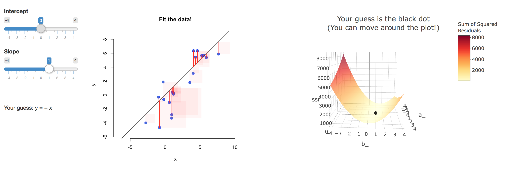

layout: true

<div class="my-footer"></div> 

---

```{r setup, include=FALSE,warning=FALSE,message=FALSE}
options(htmltools.dir.version = FALSE)
library(pacman)
p_load(broom, latex2exp, ggplot2, ggthemes, viridis, dplyr, magrittr, knitr, parallel)
# Define pink color
scpo_red <- "#d90502"
# Knitr options
opts_chunk$set(
  comment = "#>",
  fig.align = "center",
  fig.height = 7,
  fig.width = 10.5,
  # dpi = 300,
  warning = F,
  message = F,
  dev = "svg"
)
# A blank theme for ggplot
theme_empty <- theme_bw() + theme(
  line = element_blank(),
  rect = element_blank(),
  strip.text = element_blank(),
  axis.text = element_blank(),
  plot.title = element_blank(),
  axis.title = element_blank(),
  plot.margin = structure(c(0, 0, -1, -1), unit = "lines", valid.unit = 3L, class = "unit"),
  legend.position = "none"
)
theme_simple <- theme_bw() + theme(
  line = element_blank(),
  panel.grid = element_blank(),
  rect = element_blank(),
  strip.text = element_blank(),
  axis.text.x = element_text(size = 14),
  axis.text.y = element_blank(),
  axis.ticks = element_blank(),
  plot.title = element_blank(),
  axis.title = element_blank(),
  # plot.margin = structure(c(0, 0, -1, -1), unit = "lines", valid.unit = 3L, class = "unit"),
  legend.position = "none"
)
longeval = FALSE

```

# Welcome to *ScPoEconometrics: Advanced*!

.pull-left[

## Today

1. Communication: Slack Intro

2. Who Am I

3. This Course 

4. Recap 1 of topics from intro course

]

.pull-right[

 
### Next time
 
* Quiz 1 (before next time)
 
* Recap 2 

 
]

---

# Who Am I

.pull-left[
* I'm a Professor in the Dept of Economics at SciencesPo Paris. Check out my [website](https://floswald.github.io)!

* I work on urban, macro and IO topics:
    1. How to explain City Growth?
    2. How is fertility related to housing costs?
    3. How do people and firms decide where to locate?
]

--

.pull-right[
    
* I do a lot of computation (who doesn't). I like `R` (surprise!) and [`julia`](https://julialang.org) - I teach computational econ to our PhD students.

* I profited *a lot* from the open source software (OSS) community (and some good friends), and I am fascinated by how it works and the huge value it creates for everyone. 
    * OSS is key to reproducible research. 👉 seeing that every day as [Data Editor](https://ejdataeditor.github.io)
    * I try to use and teach my students tools which enable greater reproducibility.
]

---

# This Course

## Prerequisites

* This course is the *follow-up* to [Introduction to Econometrics with R](https://github.com/ScPoEcon/ScPoEconometrics-Slides) which we teach to 2nd years.

* You are supposed to be familiar with all the econometrics material from [the slides](https://github.com/ScPoEcon/ScPoEconometrics-Slides) of that course and/or chapters 1-9 in our [textbook](https://scpoecon.github.io/ScPoEconometrics/).

* We also assume you have basic `R` working knowledge at the level of the intro course!
    * basic `data.frame` manipulation with `dplyr`
    * simple linear models with `lm`
    * basic plotting with `ggplot2`
    * Quiz 1 will try and test for that 😉, so be on top of [this chapter](https://r4ds.hadley.nz/data-transform.html)

---

# This Course


.pull-left[

## Grading

1. There will be ***five quizzes*** on Moodle roughly every two weeks => 40%

1. There will be ***two take home exams / case studies*** => 60%

1. There will be _no_ final exam `r emo::ji("sweat_smile")`.
]

--

.pull-right[

## Course Materials

1. [Book](https://scpoecon.github.io/ScPoEconometrics/) chapter 10 onwards

1. The [Slides](https://github.com/ScPoEcon/Advanced-Metrics-slides)

1. The interactive [shiny apps](https://github.com/ScPoEcon/ScPoApps)

1. Quizzes on [Moodle](https://moodle.sciences-po.fr)

]

---

# Syllabus

.pull-left[
0\. Intro, Difference-in-Differences

1\. Intro, Recap 1
    (*Quiz 1*)

2\. Recap 2
    (*Quiz 2*)
    
3\. Tools: `Rmarkdown` and `data.table`

4\. Instrumental Variables 1
    (*Quiz 3*)

5\. Instrumental Variables 2
    (*Midterm exam*)
]

.pull-right[
6\. Panel Data 1

7\. Panel Data 2
    (*quiz 4*)

8\. Discrete Outcomes

9\. Intro to Machine Learning 1

10\. Intro to Machine Learning 2 

11\. Recap / Buffer
      (*Final Project*)

12\. Recap / Buffer
      (*Final Project*)
]

---
class: separator, middle

# Recap 1

Let's get cracking! 💪

---


# Population *vs.* sample

## Models and notation

We write our (simple) population model

$$ y_i = \beta_0 + \beta_1 x_i + u_i $$

and our sample-based estimated regression model as

$$ y_i = \hat{\beta}_0 + \hat{\beta}_1 x_i + e_i $$

An estimated regression model produces estimates for each observation:

$$ \hat{y}_i = \hat{\beta}_0 + \hat{\beta}_1 x_i $$

which gives us the _best-fit_ line through our dataset. 

(A lot of this set slides - in particular: pictures! - have been taken from [Ed Rubin's](https://edrub.in/index.html) outstanding material. Thanks Ed 🙏)

---
class: inverse

# Task 1: Run Simple OLS (4 minutes)
 
1. Load data [here](https://www.dropbox.com/s/wwp2cs9f0dubmhr/grade5.dta?dl=1). in `dta` format. (Hint: use `haven::read_dta("filename")` to read this format.)

1. Obtain common summary statistics for the variables `classize`, `avgmath` and `avgverb`. Hint: use the `skimr` package.

1. Estimate the linear model
    $$\text{avgmath}_i = \beta_0 + \text{classize}_i x_i + u_i$$


---
class: inverse

# Task 1: Solution

1. Load the data 
    ```{r}
    grades = haven::read_dta(file ="https://www.dropbox.com/s/wwp2cs9f0dubmhr/grade5.dta?dl=1")
    ```
1. Describe the dataset:
    ```{r,eval = FALSE}
    library(dplyr)
    grades %>% 
      select(classize,avgmath,avgverb) %>%
      skimr::skim()
    ```
1. Run OLS to estimate the relationship between class size and student achievement? 
    ```{r, eval = FALSE}
    summary(lm(formula = avgmath ~ classize, data = grades))
    ```

---
layout: true

# **Question:** Why do we care about *population vs. sample*?


---


```{R, gen dataset, include = F, cache = T}
# Set population and sample sizes
n_p <- 100
n_s <- 30
# Set the seed
set.seed(12468)
# Generate data
pop_df <- tibble(
  i = 3,
  x = rnorm(n_p, mean = 5, sd = 1.5),
  e = rnorm(n_p, mean = 0, sd = 1),
  y = i + 0.5 * x + e,
  row = rep(1:sqrt(n_p), times = sqrt(n_p)),
  col = rep(1:sqrt(n_p), each = sqrt(n_p)),
  s1 = sample(x = c(rep(T, n_s), rep(F, n_p - n_s))),
  s2 = sample(x = c(rep(T, n_s), rep(F, n_p - n_s))),
  s3 = sample(x = c(rep(T, n_s), rep(F, n_p - n_s)))
)
# Regressions
lm0 <- lm(y ~ x, data = pop_df)
lm1 <- lm(y ~ x, data = filter(pop_df, s1 == T))
lm2 <- lm(y ~ x, data = filter(pop_df, s2 == T))
lm3 <- lm(y ~ x, data = filter(pop_df, s3 == T))
# Simulation
set.seed(12468)
sim_df <- mclapply(mc.cores = 10, X = 1:1e4, FUN = function(x, size = n_s) {
  lm(y ~ x, data = pop_df %>% sample_n(size = size)) %>% tidy()
}) %>% do.call(rbind, .) %>% as_tibble()
```

.pull-left[

```{R, pop1, echo = F}
ggplot(data = pop_df, aes(x = row, y = col)) +
geom_point(color = "darkslategray", size = 10) +
theme_empty
```

.center[**Population**]

]

--

.pull-right[

```{R, scatter1, echo = F,fig.fullwidth = TRUE}
ggplot(data = pop_df, aes(x = x, y = y)) +
geom_abline(
  intercept = lm0$coefficients[1], slope = lm0$coefficients[2],
  color = scpo_red, size = 3
) +
geom_point(color = "darkslategray", size = 6) +
theme_empty
```

.center[**Population relationship**]

$$ y_i = `r round(lm0$coefficients[1], 2)` + `r round(lm0$coefficients[2], 2)` x_i + u_i $$

$$ y_i = \beta_0 + \beta_1 x_i + u_i $$


]

---

.pull-left[

```{R, sample1, echo = F, fig.fullwidth = T}
ggplot(data = pop_df, aes(x = row, y = col, shape = s1)) +
geom_point(color = "darkslategray", size = 10) +
scale_shape_manual(values = c(1, 19)) +
theme_empty
```

.center[**Sample 1:** 30 random individuals]

]

--

.pull-right[

```{R, sample1 scatter, echo = F, fig.fullwidth = T}
ggplot(data = pop_df, aes(x = x, y = y)) +
geom_abline(
  intercept = lm0$coefficients[1], slope = lm0$coefficients[2],
  color = scpo_red, size = 3, alpha = 0.3
) +
geom_point(aes(shape = s1), color = "darkslategray", size = 6) +
geom_abline(
  intercept = lm1$coefficients[1], slope = lm1$coefficients[2],
  size = 2, linetype = 2, color = "black"
) +
scale_shape_manual(values = c(1, 19)) +
theme_empty
```

.center[

**Population relationship**
<br>
$y_i = `r round(lm0$coefficients[1], 2)` + `r round(lm0$coefficients[2], 2)` x_i + u_i$

**Sample relationship**
<br>
$\hat{y}_i = `r round(lm1$coefficients[1], 2)` + `r round(lm1$coefficients[2], 2)` x_i$

]

]

---
count: false

.pull-left[

```{R, sample2, echo = F, fig.fullwidth = T}
ggplot(data = pop_df, aes(x = row, y = col, shape = s2)) +
geom_point(color = "darkslategray", size = 10) +
scale_shape_manual(values = c(1, 19)) +
theme_empty
```

.center[**Sample 2:** 30 random individuals]

]

.pull-right[

```{R, sample2 scatter, echo = F, fig.fullwidth = T}
ggplot(data = pop_df, aes(x = x, y = y)) +
geom_abline(
  intercept = lm0$coefficients[1], slope = lm0$coefficients[2],
  color = scpo_red, size = 3, alpha = 0.3
) +
geom_point(aes(shape = s2), color = "darkslategray", size = 6) +
geom_abline(
  intercept = lm1$coefficients[1], slope = lm1$coefficients[2],
  size = 2, linetype = 2, color = "black", alpha = 0.3
) +
geom_abline(
  intercept = lm2$coefficients[1], slope = lm2$coefficients[2],
  size = 2, linetype = 2, color = "black"
) +
scale_shape_manual(values = c(1, 19)) +
theme_empty
```

.center[

**Population relationship**
<br>
$y_i = `r round(lm0$coefficients[1], 2)` + `r round(lm0$coefficients[2], 2)` x_i + u_i$

**Sample relationship**
<br>
$\hat{y}_i = `r round(lm2$coefficients[1], 2)` + `r round(lm2$coefficients[2], 2)` x_i$

]

]
---
count: false

.pull-left[

```{R, sample3, echo = F, fig.fullwidth = T}
ggplot(data = pop_df, aes(x = row, y = col, shape = s3)) +
geom_point(color = "darkslategray", size = 10) +
scale_shape_manual(values = c(1, 19)) +
theme_empty
```

.center[**Sample 3:** 30 random individuals]

]

.pull-right[

```{R, sample3 scatter, echo = F, fig.fullwidth = T}
ggplot(data = pop_df, aes(x = x, y = y)) +
geom_abline(
  intercept = lm0$coefficients[1], slope = lm0$coefficients[2],
  color = scpo_red, size = 3, alpha = 0.3
) +
geom_point(aes(shape = s3), color = "darkslategray", size = 6) +
geom_abline(
  intercept = lm1$coefficients[1], slope = lm1$coefficients[2],
  size = 2, linetype = 2, color = "black", alpha = 0.3
) +
geom_abline(
  intercept = lm2$coefficients[1], slope = lm2$coefficients[2],
  size = 2, linetype = 2, color = "black", alpha = 0.3
) +
geom_abline(
  intercept = lm3$coefficients[1], slope = lm3$coefficients[2],
  size = 2, linetype = 2, color = "black"
) +
scale_shape_manual(values = c(1, 19)) +
theme_empty
```

.center[

**Population relationship**
<br>
$y_i = `r round(lm0$coefficients[1], 2)` + `r round(lm0$coefficients[2], 2)` x_i + u_i$

**Sample relationship**
<br>
$\hat{y}_i = `r round(lm3$coefficients[1], 2)` + `r round(lm3$coefficients[2], 2)` x_i$

]

]


---
layout: false
class: clear, middle

Let's repeat this **10,000 times**.

(This exercise is called a (Monte Carlo) simulation.)


---
count: false

```{R, simulation scatter, echo = F, dev = "png", dpi = 300, cache = T,eval = T}
# Reshape sim_df
line_df <- tibble(
  intercept = sim_df %>% filter(term != "x") %>% select(estimate) %>% unlist(),
  slope = sim_df %>% filter(term == "x") %>% select(estimate) %>% unlist()
)
ggplot() +
geom_abline(data = line_df, aes(intercept = intercept, slope = slope), alpha = 0.01) +
geom_point(data = pop_df, aes(x = x, y = y), size = 3, color = "darkslategray") +
geom_abline(
  intercept = lm0$coefficients[1], slope = lm0$coefficients[2],
  color = scpo_red, size = 1.5
) +
theme_empty
```

---
# Population *vs.* sample

**Question:** Why do we care about *population vs. sample*?

.pull-left[
```{R, simulation scatter2, echo = F, dev = "png", dpi = 300, cache = T}
# Reshape sim_df
ggplot() +
geom_abline(data = line_df, aes(intercept = intercept, slope = slope), alpha = 0.01, size = 1) +
geom_point(data = pop_df, aes(x = x, y = y), size = 6, color = "darkslategray") +
geom_abline(
  intercept = lm0$coefficients[1], slope = lm0$coefficients[2],
  color = scpo_red, size = 3
) +
theme_empty
```
]

.pull-right[

- On **average**, our regression lines match the population line very nicely.

- However, **individual lines** (samples) can really miss the mark.

- Differences between individual samples and the population lead to **uncertainty** for the econometrician.

]

---
layout: false

# Population *vs.* sample


**Question:** Why do we care about *population vs. sample*?

--

**Answer:** Uncertainty matters.

.pull-left[

* Every random sample of data is different.

* Our (OLS) estimators are computed from those samples of data.

* If there is sampling variation, there is variation in our estimates.

]

--

.pull-right[

* OLS inference depends on certain assumptions.

* If violated, our estimates will be biased or imprecise.

* Or both. 😧
]

---
# Linear regression

## The estimator

We can estimate a regression line in `R` (`lm(y ~ x, my_data)`) and `stata` (`reg y x`). But where do these estimates come from?

A few slides back:

> $$ \hat{y}_i = \hat{\beta}_0 + \hat{\beta}_1 x_i $$
> which gives us the *best-fit* line through our dataset.

But what do we mean by "best-fit line"?


---
layout: false

# Being the "best"

**Question:** What do we mean by *best-fit line*?

**Answers:**

- In general (econometrics), *best-fit line* means the line that minimizes the sum of squared errors (SSE):

.center[

$\text{SSE} = \sum_{i = 1}^{n} e_i^2\quad$ where $\quad e_i = y_i - \hat{y}_i$

]

- Ordinary **least squares** (**OLS**) minimizes the sum of the squared errors.
- Based upon a set of (mostly palatable) assumptions, OLS
  - Is unbiased (and consistent)
  - Is the *best* (minimum variance) linear unbiased estimator (BLUE)

---
layout: true
# OLS *vs.* other lines/estimators

---

Let's consider the dataset we previously generated.

```{R, ols vs lines 1, echo = F, fig.height = 4}
ggplot(data = pop_df, aes(x = x, y = y)) +
geom_point(size = 5, color = "darkslategray", alpha = 0.9) +
theme_empty
```

---
count: false

For any line $\left(\hat{y} = \hat{\beta}_0 + \hat{\beta}_1 x\right)$

```{R, vs lines 2, echo = F, fig.height = 4}
# Define a function
y_hat <- function(x, b0, b1) {b0 + b1 * x}
# Define line's parameters
b0 <- 6
b1 <- 0.2
# The plot
ggplot(data = pop_df, aes(x = x, y = y)) +
# geom_segment(aes(x = x, xend = x, y = y, yend = y_hat(x, b0, b1)), size = 0.5, alpha = 0.2) +
geom_point(size = 5, color = "darkslategray", alpha = 0.9) +
geom_abline(intercept = b0, slope = b1, color = "orange", size = 2, alpha = 0.9) +
theme_empty
```

---
count: false

For any line $\left(\hat{y} = \hat{\beta}_0 + \hat{\beta}_1 x\right)$, we can calculate errors: $e_i = y_i - \hat{y}_i$

```{R, ols vs lines 3, echo = F, fig.height = 4}
# Define a function
y_hat <- function(x, b0, b1) {b0 + b1 * x}
# Define line's parameters
b0 <- 6
b1 <- 0.2
# The plot
ggplot(data = pop_df, aes(x = x, y = y)) +
geom_segment(aes(x = x, xend = x, y = y, yend = y_hat(x, b0, b1)), size = 0.5, alpha = 0.2) +
geom_point(size = 5, color = "darkslategray", alpha = 0.9) +
geom_abline(intercept = b0, slope = b1, color = "orange", size = 2, alpha = 0.9) +
theme_empty
```

---
count: false

For any line $\left(\hat{y} = \hat{\beta}_0 + \hat{\beta}_1 x\right)$, we can calculate errors: $e_i = y_i - \hat{y}_i$

```{R, ols vs lines 4, echo = F, fig.height = 4}
# Define a function
y_hat <- function(x, b0, b1) {b0 + b1 * x}
# Define line's parameters
b0 <- 3
b1 <- 0.2
# The plot
ggplot(data = pop_df, aes(x = x, y = y)) +
geom_segment(aes(x = x, xend = x, y = y, yend = y_hat(x, b0, b1)), size = 0.5, alpha = 0.2) +
geom_point(size = 5, color = "darkslategray", alpha = 0.9) +
geom_abline(intercept = b0, slope = b1, color = "orange", size = 2, alpha = 0.9) +
theme_empty
```

---
count: false

For any line $\left(\hat{y} = \hat{\beta}_0 + \hat{\beta}_1 x\right)$, we can calculate errors: $e_i = y_i - \hat{y}_i$

```{R, ols vs lines 5, echo = F, fig.height = 4}
# Define a function
y_hat <- function(x, b0, b1) {b0 + b1 * x}
# Define line's parameters
b0 <- 10
b1 <- -0.8
# The plot
ggplot(data = pop_df, aes(x = x, y = y)) +
geom_segment(aes(x = x, xend = x, y = y, yend = y_hat(x, b0, b1)), size = 0.5, alpha = 0.2) +
geom_point(size = 5, color = "darkslategray", alpha = 0.9) +
geom_abline(intercept = b0, slope = b1, color = "orange", size = 2, alpha = 0.9) +
theme_empty
```

---
count: false

SSE squares the errors $\left(\sum e_i^2\right)$: bigger errors get bigger penalties.

```{R, ols vs lines 6, echo = F, fig.height = 4}
# Define a function
y_hat <- function(x, b0, b1) {b0 + b1 * x}
# Define line's parameters
b0 <- 10
b1 <- -0.8
# The plot
ggplot(data = pop_df, aes(x = x, y = y)) +
geom_segment(aes(x = x, xend = x, y = y, yend = y_hat(x, b0, b1), color = (y - y_hat(x, b0, b1))^2), size = 0.5, alpha = 0.8) +
geom_point(size = 5, color = "darkslategray", alpha = 0.9) +
geom_abline(intercept = b0, slope = b1, color = "orange", size = 2, alpha = 0.9) +
scale_color_viridis(option = "cividis", direction = -1) +
theme_empty
```

---
count: false

The OLS estimate is the combination of $\hat{\beta}_0$ and $\hat{\beta}_1$ that minimize SSE.

```{R, ols vs lines 7, echo = F, fig.height = 4}
# Define a function
y_hat <- function(x, b0, b1) {b0 + b1 * x}
# Define line's parameters
b0 <- lm0$coefficients[1]
b1 <- lm0$coefficients[2]
# The plot
ggplot(data = pop_df, aes(x = x, y = y)) +
geom_segment(aes(x = x, xend = x, y = y, yend = y_hat(x, b0, b1), color = (y - y_hat(x, b0, b1))^2), size = 0.5, alpha = 0.8) +
geom_point(size = 5, color = "darkslategray", alpha = 0.9) +
geom_abline(intercept = b0, slope = b1, color = scpo_red, size = 2, alpha = 0.9) +
scale_color_viridis(option = "cividis", direction = -1) +
theme_empty
```

---
layout: false
class: middle


```{r,eval=FALSE}
ScPoApps::launchApp("reg_simple")
```


---
layout: true
# OLS

## Formally

---

In simple linear regression, the OLS estimator comes from choosing the $\hat{\beta}_0$ and $\hat{\beta}_1$ that minimize the sum of squared errors (SSE), _i.e._,

$$ \min_{\hat{\beta}_0,\, \hat{\beta}_1} \text{SSE} $$

--

but we already know $\text{SSE} = \sum_i e_i^2$. Now use the definitions of $e_i$ and $\hat{y}$.

$$
\begin{aligned}
  e_i^2 &= \left( y_i - \hat{y}_i \right)^2 = \left( y_i - \hat{\beta}_0 - \hat{\beta}_1 x_i \right)^2 \\
  &= y_i^2 - 2 y_i \hat{\beta}_0 - 2 y_i \hat{\beta}_1 x_i + \hat{\beta}_0^2 + 2 \hat{\beta}_0 \hat{\beta}_1 x_i + \hat{\beta}_1^2 x_i^2
\end{aligned}
$$

--

**Recall:** Minimizing a multivariate function requires (**1**) first derivatives equal zero (the *1.super[st]-order conditions*) and (**2**) second-order conditions (concavity).

---
layout: false

# OLS

## Interactively

```{r,eval=FALSE}
ScPoApps::launchApp("SSR_cone")
```

```{r,echo = FALSE}

```


---
# OLS

## Interactively

We skipped the maths. 

We now have the OLS estimators for the slope

$$ \hat{\beta}_1 = \dfrac{\sum_i (x_i - \overline{x})(y_i - \overline{y})}{\sum_i (x_i - \overline{x})^2} $$

and the intercept

$$ \hat{\beta}_0 = \overline{y} - \hat{\beta}_1 \overline{x} $$

Remember that *those* two formulae are amongst the very few ones from the intro course that you should know by heart! ❤️

--

We now turn to the assumptions and (implied) properties of OLS.


---
layout: true
# OLS: Assumptions and properties

---

**Question:** What properties might we care about for an estimator?

--

**Tangent:** Let's review statistical properties first.

---

**Refresher:** Density functions

Recall that we use **probability density functions** (PDFs) to describe the probability a **continuous random variable** takes on a range of values. (The total area = 1.)

These PDFs characterize probability distributions, and the most common/famous/popular distributions get names (_e.g._, normal, *t*, Gamma).

Here is the definition of a *PDF* $f_X$for a *continuous* RV $X$:

$$
\Pr[a \leq X \leq b] \equiv \int_a^b f_X (x) dx
$$

---

**Refresher:** Density functions

The probability a standard normal random variable takes on a value between -2 and 0: $\mathop{\text{P}}\left(-2 \leq X \leq 0\right) = 0.48$

```{R, example: pdf, echo = F, fig.height = 3}
# Generate data for density's polygon
tmp <- tibble(x = seq(-4, 4, 0.01), y = dnorm(x))
tmp <- rbind(tmp, tibble(x = seq(4, -4, -0.01), y = 0))
# Plot it
ggplot(data = tmp, aes(x, y)) +
geom_polygon(fill = "grey85") +
geom_polygon(data = tmp %>% filter(between(x, -2, 0)), fill = scpo_red) +
geom_hline(yintercept = 0, color = "black") +
theme_simple
```

---

**Refresher:** Density functions

The probability a standard normal random variable takes on a value between -1.96 and 1.96: $\mathop{\text{P}}\left(-1.96 \leq X \leq 1.96\right) = 0.95$

```{R, example: pdf 2, echo = F, fig.height = 3}
# Generate data for density's polygon
tmp <- tibble(x = seq(-4, 4, 0.01), y = dnorm(x))
tmp <- rbind(tmp, tibble(x = seq(4, -4, -0.01), y = 0))
# Plot it
ggplot(data = tmp, aes(x, y)) +
geom_polygon(fill = "grey85") +
geom_polygon(data = tmp %>% filter(between(x, -1.96, 1.96)), fill = scpo_red) +
geom_hline(yintercept = 0, color = "black") +
theme_simple
```

---

**Refresher:** Density functions

The probability a standard normal random variable takes on a value beyond 2: $\mathop{\text{P}}\left(X > 2\right) = 0.023$

```{R, example: pdf 3, echo = F, fig.height = 3}
# Generate data for density's polygon
tmp <- tibble(x = seq(-4, 4, 0.01), y = dnorm(x))
tmp <- rbind(tmp, tibble(x = seq(4, -4, -0.01), y = 0))
# Plot it
ggplot(data = tmp, aes(x, y)) +
geom_polygon(fill = "grey85") +
geom_polygon(data = tmp %>% filter(between(x, 2, Inf)), fill = scpo_red) +
geom_hline(yintercept = 0, color = "black") +
theme_simple
```

---

Imagine we are trying to estimate an unknown parameter $\beta$, and we know the distributions of three competing estimators. Which one would we want? How would we decide?

```{R, competing pdfs, echo = F, fig.height = 4.5}
# Generate data for densities' polygons
d1 <- tibble(x = seq(-7.5, 7.5, 0.01), y = dnorm(x, mean = 1, sd = 1)) %>%
  rbind(., tibble(x = seq(7.5, -7.5, -0.01), y = 0))
d2 <- tibble(x = seq(-7.5, 7.5, 0.01), y = dunif(x, min = -2.5, max = 1.5)) %>%
  rbind(., tibble(x = seq(7.5, -7.5, -0.01), y = 0))
d3 <- tibble(x = seq(-7.5, 7.5, 0.01), y = dnorm(x, mean = 0, sd = 2.5)) %>%
  rbind(., tibble(x = seq(7.5, -7.5, -0.01), y = 0))
# Plot them
ggplot() +
geom_polygon(data = d1, aes(x, y), alpha = 0.8, fill = "orange") +
geom_polygon(data = d2, aes(x, y), alpha = 0.65, fill = scpo_red) +
geom_polygon(data = d3, aes(x, y), alpha = 0.6, fill = "darkslategray") +
geom_hline(yintercept = 0, color = "black") +
geom_vline(xintercept = 0, size = 1, linetype = "dashed") +
scale_x_continuous(breaks = 0, labels = TeX("$\\beta$")) +
theme_simple +
theme(axis.text.x = element_text(size = 20))
```

---

**Question:** What properties might we care about for an estimator?

--

**Answer one: Bias.**

On average (after *many* samples), does the estimator tend toward the correct value?

**More formally:** Does the mean of estimator's distribution equal the parameter it estimates?

$$ \mathop{\text{Bias}}_\beta \left( \hat{\beta} \right) = \mathop{\boldsymbol{E}}\left[ \hat{\beta} \right] - \beta $$

---

**Answer one: Bias.**

.pull-left[

**Unbiased estimator:** $\mathop{\boldsymbol{E}}\left[ \hat{\beta} \right] = \beta$

```{R, unbiased pdf, echo = F}
ggplot(data = tmp, aes(x, y)) +
geom_polygon(fill = scpo_red, alpha = 0.9) +
geom_hline(yintercept = 0, color = "black") +
geom_vline(xintercept = 0, size = 1, linetype = "dashed") +
scale_x_continuous(breaks = 0, labels = TeX("$\\beta$")) +
theme_simple +
theme(axis.text.x = element_text(size = 40))
```

]

--

.pull-right[

**Biased estimator:** $\mathop{\boldsymbol{E}}\left[ \hat{\beta} \right] \neq \beta$

```{R, biased pdf, echo = F}
ggplot(data = tmp, aes(x, y)) +
geom_polygon(aes(x = x + 2), fill = "darkslategray", alpha = 0.9) +
geom_hline(yintercept = 0, color = "black") +
geom_vline(xintercept = 0, size = 1, linetype = "dashed") +
scale_x_continuous(breaks = 0, labels = TeX("$\\beta$")) +
theme_simple +
theme(axis.text.x = element_text(size = 40))
```

]

---

**Answer two: Variance.**

The central tendencies (means) of competing distributions are not the only things that matter. We also care about the **variance** of an estimator.

$$ \mathop{\text{Var}} \left( \hat{\beta} \right) = \mathop{\boldsymbol{E}}\left[ \left( \hat{\beta} - \mathop{\boldsymbol{E}}\left[ \hat{\beta} \right] \right)^2 \right] $$

Lower variance estimators mean we get estimates closer to the mean in each sample.

---
count: false

**Answer two: Variance.**

```{R, variance pdf, echo = F, fig.height = 5}
d4 <- tibble(x = seq(-7.5, 7.5, 0.01), y = dnorm(x, mean = 0, sd = 1)) %>%
  rbind(., tibble(x = seq(7.5, -7.5, -0.01), y = 0))
d5 <- tibble(x = seq(-7.5, 7.5, 0.01), y = dnorm(x, mean = 0, sd = 2)) %>%
  rbind(., tibble(x = seq(7.5, -7.5, -0.01), y = 0))
ggplot() +
geom_polygon(data = d4, aes(x, y), fill = scpo_red, alpha = 0.9) +
geom_polygon(data = d5, aes(x, y), fill = "darkslategray", alpha = 0.8) +
geom_hline(yintercept = 0, color = "black") +
geom_vline(xintercept = 0, size = 1, linetype = "dashed") +
scale_x_continuous(breaks = 0, labels = TeX("$\\beta$")) +
theme_simple +
theme(axis.text.x = element_text(size = 20))
```

---

**Answer one: Bias.**

**Answer two: Variance.**

**Subtlety:** The bias-variance tradeoff.

Should we be willing to take a bit of bias to reduce the variance?

In econometrics, we generally stick with unbiased (or consistent) estimators. But other disciplines (especially computer science) think a bit more about this tradeoff.

---
layout: false

# The bias-variance tradeoff.

```{R, variance bias, echo = F, fig.height=5}
d4 <- tibble(x = seq(-7.5, 7.5, 0.01), y = dnorm(x, mean = 0.3, sd = 1)) %>%
  rbind(., tibble(x = seq(7.5, -7.5, -0.01), y = 0))
d5 <- tibble(x = seq(-7.5, 7.5, 0.01), y = dnorm(x, mean = 0, sd = 2)) %>%
  rbind(., tibble(x = seq(7.5, -7.5, -0.01), y = 0))
ggplot() +
geom_polygon(data = d4, aes(x, y), fill = scpo_red, alpha = 0.9) +
geom_polygon(data = d5, aes(x, y), fill = "darkslategray", alpha = 0.8) +
geom_hline(yintercept = 0, color = "black") +
geom_vline(xintercept = 0, size = 1, linetype = "dashed") +
scale_x_continuous(breaks = 0, labels = TeX("$\\beta$")) +
theme_simple +
theme(axis.text.x = element_text(size = 20))
```

---
# OLS: Assumptions and properties

## Properties

As you might have guessed by now,

- OLS is **unbiased**.
- OLS has the **minimum variance** of all unbiased linear estimators.

---
# OLS: Assumptions and properties

## Properties

But... these (very nice) properties depend upon a set of assumptions:

1. The population relationship is linear in parameters with an additive disturbance.

2. Our $X$ variable is **exogenous**, _i.e._, $\mathop{\boldsymbol{E}}\left[ u |X \right] = 0$.

3. The $X$ variable has variation. And if there are multiple explanatory variables, they are not perfectly collinear.

4. The population disturbances $u_i$ are independently and identically distributed as normal random variables with mean zero $\left( \mathop{\boldsymbol{E}}\left[ u \right] = 0 \right)$ and variance $\sigma^2$ (_i.e._,  $\mathop{\boldsymbol{E}}\left[ u^2 \right] = \sigma^2$). Independently distributed and mean zero jointly imply $\mathop{\boldsymbol{E}}\left[ u_i u_j \right] = 0$ for any $i\neq j$.

---
# OLS: Assumptions and properties

## Assumptions

Different assumptions guarantee different properties:

- Assumptions (1), (2), and (3) make OLS unbiased.
- Assumption (4) gives us an unbiased estimator for the variance of our OLS estimator.

We will discuss solutions to **violations of these assumptions**. See also our discussion [in the book](https://scpoecon.github.io/ScPoEconometrics/std-errors.html#class-reg)

- Non-linear relationships in our parameters/disturbances (or misspecification).
- Disturbances that are not identically distributed and/or not independent.
- Violations of exogeneity (especially omitted-variable bias).

---
# OLS: Assumptions and properties

## Conditional expectation

For many applications, our most important assumption is **exogeneity**, _i.e._,
$$
\begin{align}
  \mathop{E}\left[ u | X \right] = 0
\end{align}
$$
but what does it actually mean?

--

One way to think about this definition:

> For *any* value of $X$, the mean of the residuals must be zero.

- _E.g._, $\mathop{E}\left[ u | X=1 \right]=0$ *and* $\mathop{E}\left[ u | X=100 \right]=0$

- _E.g._, $\mathop{E}\left[ u | X_2=\text{Female} \right]=0$ *and* $\mathop{E}\left[ u | X_2=\text{Male} \right]=0$

- Notice: $\mathop{E}\left[ u | X \right]=0$ is more restrictive than $\mathop{E}\left[ u \right]=0$
---
layout: false
class: clear, middle

Graphically...
---
exclude: true

```{R, conditional_expectation_setup, include = F, cache = T}

# Setup ----------------------------------------------------------------------------------
  # Options
  options(stringsAsFactors = F)
  # Packages
  library(pacman)
  p_load(ggridges)

# Data work ------------------------------------------------------------------------------
  # Set seed
  set.seed(12345)
  # Sample size
  n <- 1e5
  # Exogenous
  e_good <- tibble(
    x = runif(n = n, min = -4, max = 4),
    e = rnorm(n)
  ) %>% mutate(x = round(x))
  # Endogenous
  e_bad <- tibble(
    x = runif(n = n, min = -4, max = 4),
    e = rnorm(n) + 0.5 * x
  ) %>% mutate(x = round(x))

# Figures: Joint densities ---------------------------------------------------------------
  # The joint plot: good
  joint_good <- ggplot(data = e_good, aes(x = e)) +
    geom_density() +
    theme_pander()
  # The joint plot: bad
  joint_bad <- ggplot(data = e_bad, aes(x = e)) +
    geom_density() +
    theme_pander()

# Figures: Conditional densities ---------------------------------------------------------
  cond_good <- ggplot(data = e_good, aes(x = e, y = as.factor(x))) +
    geom_density_ridges_gradient(
      aes(fill = ..x..),
      color = "white",
      scale = 2.5,
      size = 0.2
    ) +
    # geom_vline(xintercept = 0, alpha = 0.3) +
    scale_fill_viridis(option = "magma") +
    xlab("u") +
    ylab("X") +
    theme_pander(base_family = "Fira Sans Book", base_size = 18) +
    theme(
      legend.position = "none",
      axis.title.y = element_text(angle = 0, vjust = 0.5, family = "MathJax_Math", size = 22),
      axis.title.x = element_text(family = "MathJax_Math", size = 22)
    )
  cond_bad <- ggplot(data = e_bad, aes(x = e, y = as.factor(x))) +
    geom_density_ridges_gradient(
      aes(fill = ..x..),
      color = "white",
      scale = 2.5,
      size = 0.2
    ) +
    # geom_vline(xintercept = 0, alpha = 0.3) +
    scale_fill_viridis(option = "magma") +
    xlab("u") +
    ylab("X") +
    theme_pander(base_family = "Fira Sans Book", base_size = 18) +
    theme(
      legend.position = "none",
      axis.title.y = element_text(angle = 0, vjust = 0.5, family = "MathJax_Math", size = 22),
      axis.title.x = element_text(family = "MathJax_Math", size = 22)
    )
```
---
class: clear

Valid exogeneity, _i.e._, $\mathop{E}\left[ u | X \right] = 0$

```{R, ex_good_exog, echo = F,fig.height = 6}
cond_good
```
---
class: clear

Invalid exogeneity, _i.e._, $\mathop{E}\left[ u | X \right] \neq 0$

```{R, ex_bad_exog, echo = F,fig.height = 6}
cond_bad
```

---
layout: false
class: title-slide-final, middle
background-image: url(../../img/logo/ScPo-econ.png)
background-size: 250px
background-position: 9% 19%

# END


|                                                                                                            |                                   |
| :--------------------------------------------------------------------------------------------------------- | :-------------------------------- |
| <a href="mailto:florian.oswald@sciencespo.fr">.ScPored[<i class="fa fa-paper-plane fa-fw"></i>]               | florian.oswald@sciencespo.fr       |
| <a href="https://github.com/ScPoEcon/Advanced-Metrics-slides">.ScPored[<i class="fa fa-link fa-fw"></i>] | Slides |
| <a href="https://scpoecon.github.io/ScPoEconometrics">.ScPored[<i class="fa fa-link fa-fw"></i>] | Book |
| <a href="http://twitter.com/ScPoEcon">.ScPored[<i class="fa fa-twitter fa-fw"></i>]                          | @ScPoEcon                         |
| <a href="http://github.com/ScPoEcon">.ScPored[<i class="fa fa-github fa-fw"></i>]                          | @ScPoEcon                       |


