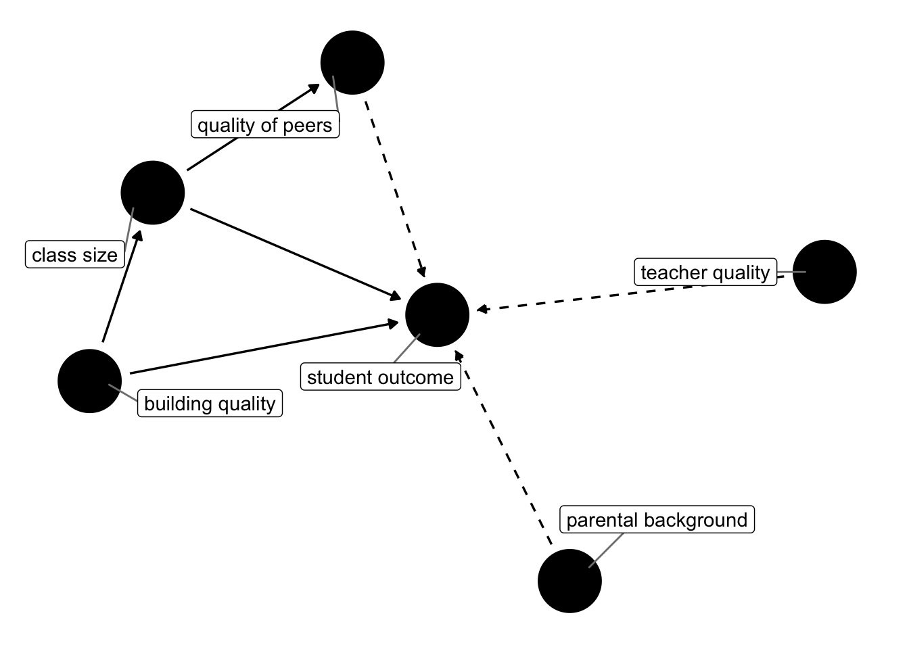

layout: true

<div class="my-footer"></div> 

---

```{r setup, include=FALSE,warning=FALSE,message=FALSE}
options(htmltools.dir.version = FALSE)
library(pacman)
p_load(broom, latex2exp, ggplot2, ggthemes,  ggforce, viridis, dplyr, magrittr, knitr, parallel)
# Define pink color
scpo_red <- "#d90502"
# Knitr options
opts_chunk$set(
  comment = "#>",
  fig.align = "center",
  fig.height = 7,
  fig.width = 10.5,
  # dpi = 300,
  warning = F,
  message = F,
  dev = "svg",
  echo = FALSE
)
# A blank theme for ggplot
theme_empty <- theme_bw() + theme(
  line = element_blank(),
  rect = element_blank(),
  strip.text = element_blank(),
  axis.text = element_blank(),
  plot.title = element_blank(),
  axis.title = element_blank(),
  plot.margin = structure(c(0, 0, -1, -1), unit = "lines", valid.unit = 3L, class = "unit"),
  legend.position = "none"
)
theme_simple <- theme_bw() + theme(
  line = element_blank(),
  panel.grid = element_blank(),
  rect = element_blank(),
  strip.text = element_blank(),
  axis.text.x = element_text(size = 14),
  axis.text.y = element_blank(),
  axis.ticks = element_blank(),
  plot.title = element_blank(),
  axis.title = element_blank(),
  # plot.margin = structure(c(0, 0, -1, -1), unit = "lines", valid.unit = 3L, class = "unit"),
  legend.position = "none"
)
theme_axes <- theme_empty + theme(
  axis.title = element_text(size = 18),
  plot.margin = structure(c(0, 0, 0.1, 0), unit = "lines", valid.unit = 3L, class = "unit"),
)

```

```{R, colors, include = F}
# Define pink color
scpo_red <- "#d90502"
turquoise <- "#20B2AA"
orange <- "#FFA500"
red <- "#fb6107"
blue <- "#2b59c3"
green <- "#8bb174"
grey_light <- "grey70"
grey_mid <- "grey50"
grey_dark <- "grey20"
purple <- "#6A5ACD"
```

# Recap 2

.pull-left[

* Last time, we refreshed our basic OLS knowledge

* Today we continue and look at more than one explanatory variable, and associated problems

]


.pull-right[

* But, why *more than one variable*?

* Like, **how many** other variables?

* And, above all: **which ones** ? 🤔


]

--

<br>
<br>

.center[We will remember what we meant by **a model**.]

---

# Back to the STAR Experiment

.left-thin[

* Remember what we learned about the [STAR Experiment](https://scpoecon.github.io/ScPoEconometrics/STAR.html)

* What is the causal impact of class size on test scores?

* $\text{score}_i = \beta_0 + \beta_1 \text{classize}_i + u_i$ ?
 
* We use a **model** to order our thoughts about how a causal impact is determined. 

]

--

.right-wide[
```{r,echo=FALSE}

```
]

---
class: middle

# Multiple Variables

Let's augment our model with more variables:

$$y = \beta_0 + \beta_1 x_1 + \beta_2 x_2  + \beta_3 x_3 +u$$


---
# Spot the Difference 🕵️


```{r dag1,fig.height = 4}
library(ggdag)
library(dplyr)
dag = dagify(y ~ x1,
            y ~ x2,
            y ~ x3,
            x1 ~ x2,
            x3 ~ x2,
       coords = list(x = c("x2" = 0,"x1" = 1,"x3" = 1.0,"y" = 2),
                     y = c("x2" = 0,"x1" = 0.5,"x3" = -0.5,"y" = 0)))
p1 = dag %>%
  ggdag() + theme_dag()
p2 = dag %>%
  tidy_dagitty() %>%
      mutate(linetype = if_else(name =="x2", "dashed","solid")) %>% 
    ggplot(aes(x = x, y = y, xend = xend, yend = yend)) + 
    geom_dag_point() + 
      geom_dag_text(col = "white") +
    geom_dag_edges(aes(edge_linetype = linetype), show.legend = FALSE) + theme_dag()
cowplot::plot_grid(p1,p2,align = "v")
```

---

layout: false
class: title-slide-section-red, middle

# Omitted-variable bias

---
layout: true
# Omitted-variable bias

---


**Omitted-variable bias** (OVB) arises when we omit a variable that

1. affects our outcome variable $y$

2. correlates with an explanatory variable $x_j$

As it's name suggests, this situation leads to bias in our estimate of $\beta_j$.

--

**Note:** OVB Is not exclusive to multiple linear regression, but it does require multiple variables affect $y$.

---

**Example**

Let's imagine a simple model for the amount individual $i$ gets paid

$$ \text{Pay}_i = \beta_0 + \beta_1 \text{School}_i + \beta_2 \text{Male}_i + u_i $$

where

- $\text{School}_i$ gives $i$'s years of schooling
- $\text{Male}_i$ denotes an indicator variable for whether individual $i$ is male.

thus

- $\beta_1$: the returns to an additional year of schooling (*ceteris paribus*)
- $\beta_2$: the premium for being male (*ceteris paribus*)
<br>If $\beta_2 > 0$, then there is discrimination against women—receiving less pay based upon gender.

---
layout: true
# Omitted-variable bias

**Example, continued**

---

From our population model

$$ \text{Pay}_i = \beta_0 + \beta_1 \text{School}_i + \beta_2 \text{Male}_i + u_i $$

If a study focuses on the relationship between pay and schooling, _i.e._,

$$ \text{Pay}_i = \beta_0 + \beta_1 \text{School}_i + \left(\beta_2 \text{Male}_i + u_i\right) $$
$$ \text{Pay}_i = \beta_0 + \beta_1 \text{School}_i + \varepsilon_i $$

where $\varepsilon_i = \beta_2 \text{Male}_i + u_i$.

We used our exogeneity assumption to derive OLS' unbiasedness. But even if $\mathop{\boldsymbol{E}}\left[ u | X \right] = 0$, it is not true that $\mathop{\boldsymbol{E}}\left[ \varepsilon | X \right] = 0$ so long as $\beta_2 \neq 0$.

Specifically, $\mathop{\boldsymbol{E}}\left[ \varepsilon | \text{Male} = 1 \right] = \beta_2 + \mathop{\boldsymbol{E}}\left[ u | \text{Male} = 1 \right] \neq 0$.
--
 **Now OLS is biased.**

---

Let's try to see this result graphically.

```{R, gen ovb data, include = F, cache = T}
# Set seed
set.seed(12345)
# Sample size
n <- 1e3
# Parameters
beta0 <- 20; beta1 <- 0.5; beta2 <- 10
# Dataset
omit_df <- tibble(
  male = sample(x = c(F, T), size = n, replace = T),
  school = runif(n, 3, 9) - 3 * male,
  pay = beta0 + beta1 * school + beta2 * male + rnorm(n, sd = 7)
)
lm_bias <- lm(pay ~ school, data = omit_df)
bb0 <- lm_bias$coefficients[1] %>% round(1)
bb1 <- lm_bias$coefficients[2] %>% round(1)
lm_unbias <- lm(pay ~ school + male, data = omit_df)
bu0 <- lm_unbias$coefficients[1] %>% round(1)
bu1 <- lm_unbias$coefficients[2] %>% round(1)
bu2 <- lm_unbias$coefficients[3] %>% round(1)
```

The population model:

$$ \text{Pay}_i = `r beta0` + `r beta1` \times \text{School}_i + `r beta2` \times \text{Male}_i + u_i $$

Our regression model that suffers from omitted-variable bias:

$$ \text{Pay}_i = \hat{\beta}_0 + \hat{\beta}_1 \times \text{School}_i + e_i $$

Finally, imagine that women, on average, receive more schooling than men.

---
layout: true
# Omitted-variable bias
**Example, continued:** $\text{Pay}_i = `r beta0` + `r beta1` \times \text{School}_i + `r beta2` \times \text{Male}_i + u_i$

---

The relationship between pay and schooling.

```{R, plot ovb 1, echo = F, dev = "svg", fig.height = 4.0}
ggplot(data = omit_df, aes(x = school, y = pay)) +
geom_point(size = 2.5, color = "black", alpha = 0.4, shape = 16) +
geom_hline(yintercept = 0) +
geom_vline(xintercept = 0) +
xlab("Schooling") +
ylab("Pay") +
theme_empty +
theme(
  axis.title = element_text(size = 18),
  plot.margin = structure(c(0, 0, 0.1, 0), unit = "lines", valid.unit = 3L, class = "unit"),
)
```
---
count: false
Biased regression estimate: $\widehat{\text{Pay}}_i = `r bb0` + `r bb1` \times \text{School}_i$

```{R, plot ovb 2, echo = F, dev = "svg", fig.height = 4.0}
ggplot(data = omit_df, aes(x = school, y = pay)) +
geom_point(size = 2.5, color = "black", alpha = 0.4, shape = 16) +
geom_hline(yintercept = 0) +
geom_vline(xintercept = 0) +
geom_smooth(se = F, color = "orange", method = lm) +
xlab("Schooling") +
ylab("Pay") +
theme_empty +
theme(
  axis.title = element_text(size = 18),
  plot.margin = structure(c(0, 0, 0.1, 0), unit = "lines", valid.unit = 3L, class = "unit"),
)
```

---
count: false
Recalling the omitted variable: Gender **female** and .hi-slate[male]

```{R, plot ovb 3, echo = F, dev = "svg", fig.height = 4.0}
ggplot(data = omit_df, aes(x = school, y = pay)) +
geom_point(size = 2.5, alpha = 0.8, aes(color = male, shape = male)) +
geom_hline(yintercept = 0) +
geom_vline(xintercept = 0) +
geom_line(stat = "smooth", color = "orange", method = lm, alpha = 0.5, size = 1) +
xlab("Schooling") +
ylab("Pay") +
theme_empty +
theme(
  axis.title = element_text(size = 18),
  plot.margin = structure(c(0, 0, 0.1, 0), unit = "lines", valid.unit = 3L, class = "unit"),
) +
scale_color_manual("", values = c(scpo_red, "darkslategrey"), labels = c("Female", "Male")) +
scale_shape_manual("", values = c(16, 1), labels = c("Female", "Male"))
```

---
count: false
Recalling the omitted variable: Gender **female** and .hi-slate[male]

```{R, plot ovb 4, echo = F, dev = "svg", fig.height = 4.0}
ggplot(data = omit_df, aes(x = school, y = pay)) +
geom_point(size = 2.5, alpha = 0.8, aes(color = male, shape = male)) +
geom_hline(yintercept = 0) +
geom_vline(xintercept = 0) +
geom_line(stat = "smooth", color = "orange", method = lm, alpha = 0.2, size = 1) +
geom_abline(
  intercept = lm_unbias$coefficients[1],
  slope = lm_unbias$coefficients[2],
  color = scpo_red, size = 1
) +
geom_abline(
  intercept = lm_unbias$coefficients[1] + lm_unbias$coefficients[3],
  slope = lm_unbias$coefficients[2],
  color = "darkslategrey", size = 1
) +
xlab("Schooling") +
ylab("Pay") +
theme_empty +
theme(
  axis.title = element_text(size = 18),
  plot.margin = structure(c(0, 0, 0.1, 0), unit = "lines", valid.unit = 3L, class = "unit"),
) +
scale_color_manual("", values = c(scpo_red, "darkslategrey"), labels = c("Female", "Male")) +
scale_shape_manual("", values = c(16, 1), labels = c("Female", "Male"))
```

---
count: false
Unbiased regression estimate: $\widehat{\text{Pay}}_i = `r bu0` + `r bu1` \times \text{School}_i + `r bu2` \times \text{Male}_i$

```{R, plot ovb 5, echo = F, dev = "svg", fig.height = 4.0}
ggplot(data = omit_df, aes(x = school, y = pay)) +
geom_point(size = 2.5, alpha = 0.8, aes(color = male, shape = male)) +
geom_hline(yintercept = 0) +
geom_vline(xintercept = 0) +
geom_line(stat = "smooth", color = "orange", method = lm, alpha = 0.2, size = 1) +
geom_abline(
  intercept = lm_unbias$coefficients[1],
  slope = lm_unbias$coefficients[2],
  color = scpo_red, size = 1
) +
geom_abline(
  intercept = lm_unbias$coefficients[1] + lm_unbias$coefficients[3],
  slope = lm_unbias$coefficients[2],
  color = "darkslategrey", size = 1
) +
xlab("Schooling") +
ylab("Pay") +
theme_empty +
theme(
  axis.title = element_text(size = 18),
  plot.margin = structure(c(0, 0, 0.1, 0), unit = "lines", valid.unit = 3L, class = "unit"),
) +
scale_color_manual("", values = c(scpo_red, "darkslategrey"), labels = c("Female", "Male")) +
scale_shape_manual("", values = c(16, 1), labels = c("Female", "Male"))
```
---
layout: false
class: clear, middle, center

```{R, venn2, dev = "svg", echo = F,eval = F}
# Line types (order: x1, x2, x3, y)
venn_lines <- c("solid", "dotted", "dotted", "solid")
# Venn
ggplot(data = venn_df, aes(x0 = x, y0 = y, r = r, fill = l, color = l)) +
geom_circle(aes(linetype = l), alpha = 0.3, size = 0.75) +
theme_void() +
theme(legend.position = "none") +
scale_fill_manual(values = venn_colors) +
scale_color_manual(values = venn_colors) +
scale_linetype_manual(values = venn_lines) +
geom_text(aes(x = xl, y = yl, label = l), size = 9, family = "Fira Sans Book", parse = T) +
annotate(
  x = -5.5, y = 3.3,
  geom = "text", label = "Omitted variables", size = 9, family = "Fira Sans Book", hjust = 0
) +
xlim(-5.5, 4.5) +
ylim(-4.2, 3.4) +
coord_equal()
```

```{r}

```
---
layout: false

# Omitted-variable bias

## Solutions

1. Don't omit variables 😜

2. Instrumental variables and two-stage least squares (coming soon): If we could find something that **only** affects $x_1$ but *not* the omitted variable, we can make progress!

3. Use multiple observations for the same unit $i$: panel data.

**Warning:** There are situations in which neither solution is possible.

--

1. Proceed with caution (sometimes you can sign the bias).

2. The key is to have a mental map of *should* belong to the model. 


---


---
layout: false
class: separator, middle

# Interpreting coefficients


---
# Interpreting coefficients
## Continuous variables

Consider the relationship

$$ \text{Pay}_i = \beta_0 + \beta_1 \, \text{School}_i + u_i $$

where

- $\text{Pay}_i$ is a continuous variable measuring an individual's pay
- $\text{School}_i$ is a continuous variable that measures years of education

---

# Interpreting coefficients
**Interpretations**

- $\beta_0$: the $y$-intercept, _i.e._, $\text{Pay}$ when $\text{School} = 0$
- $\beta_1$: the expected increase in $\text{Pay}$ for a one-unit increase in $\text{School}$

---
# Interpreting coefficients
## Continuous variables


Consider the model

$$ y = \beta_0 + \beta_1 \, x + u $$

Differentiate the model:

$$ \dfrac{dy}{dx} = \beta_1 $$

---
class: inverse

# Task 1: Interpretation (4 minutes)

1. Load the `wage1` dataset from the `wooldridge` package. you may have to install this first.

2. Run `skimr::skim` on the dataset to get an overview. what is the fraciton of nonwhite in the data?

3. Regressing wage on education and tenure, what is the interpretation of the `tenure` coefficient? You may need to consult `?wage1` here.

---
# Interpreting coefficients
## Categorical variables

Consider the relationship

$$ \text{Pay}_i = \beta_0 + \beta_1 \, \text{Female}_i + u_i $$

where

- $\text{Pay}_i$ is a continuous variable measuring an individual's pay
- $\text{Female}_i$ is a binary/indicator variable taking $1$ when $i$ is female

---
# Interpreting coefficients
**Interpretations**

- $\beta_0$: the expected $\text{Pay}$ for males (_i.e._, when $\text{Female} = 0$)
- $\beta_1$: the expected difference in $\text{Pay}$ between females and males
- $\beta_0 + \beta_1$: the expected $\text{Pay}$ for females

---
# Interpreting coefficients
## Categorical variables

Derivations

$$
\begin{aligned}
 \mathop{\boldsymbol{E}}\left[ \text{Pay} | \text{Male} \right] &=
 \mathop{\boldsymbol{E}}\left[ \beta_0 + \beta_1\times 0 + u_i \right] \\
 &= \mathop{\boldsymbol{E}}\left[ \beta_0 + 0 + u_i \right] \\
 &= \beta_0
\end{aligned}
$$

--

$$
\begin{aligned}
 \mathop{\boldsymbol{E}}\left[ \text{Pay} | \text{Female} \right] &=
 \mathop{\boldsymbol{E}}\left[ \beta_0 + \beta_1\times 1 + u_i \right] \\
 &= \mathop{\boldsymbol{E}}\left[ \beta_0 + \beta_1 + u_i \right] \\
 &= \beta_0 + \beta_1
\end{aligned}
$$

--

**Note:** If there are no other variables to condition on, then $\hat{\beta}_1$ equals the difference in group means, _e.g._, $\overline{x}_\text{Female} - \overline{x}_\text{Male}$.

--

**Note<sub>2</sub>:** The *holding all other variables constant* interpretation also applies for categorical variables in multiple regression settings.

---
# Interpreting coefficients
## Categorical variables

$y_i = \beta_0 + \beta_1 x_i + u_i$ for binary variable $x_i = \{\color{#314f4f}{0}, \, \color{#d90502}{1}\}$

```{R, cat data, include = F}
# Set seed
set.seed(1235)
# Sample size
n <- 5e3
# Generate data
cat_df <- tibble(
  x = sample(x = c(0, 1), size = n, replace = T),
  y = 3 + 7 * x + rnorm(n, sd = 2)
)
# Regression
cat_reg <- lm(y ~ x, data = cat_df)
```

```{R, dat plot 1, echo = F, dev = "svg", fig.height = 3.5}
set.seed(12345)
ggplot(data = cat_df, aes(x = x, y = y, color = as.factor(x))) +
geom_jitter(width = 0.3, size = 1.5, alpha = 0.5) +
scale_color_manual(values = c("darkslategrey", scpo_red)) +
theme_empty
```

---
# Interpreting coefficients
## Categorical variables

$y_i = \beta_0 + \beta_1 x_i + u_i$ for binary variable $x_i = \{\color{#314f4f}{0}, \, \color{#d90502}{1}\}$

```{R, dat plot 2, echo = F, dev = "svg", fig.height = 3.5}
set.seed(12345)
ggplot(data = cat_df, aes(x = x, y = y, color = as.factor(x))) +
geom_jitter(width = 0.3, size = 1.5, alpha = 0.5) +
scale_color_manual(values = c("darkslategrey", scpo_red)) +
geom_hline(yintercept = cat_reg$coefficients[1], size = 1, color = "darkslategrey") +
geom_hline(yintercept = cat_reg$coefficients[1] + cat_reg$coefficients[2], size = 1, color = scpo_red) +
annotate(
  geom = "text",
  x = 0.5,
  y = -1 + cat_reg$coefficients[1],
  label = TeX("$\\hat{\\beta}_0 = \\bar{Group_0}$"),
  size = 7
) +
annotate(
  geom = "text",
  x = 0.5,
  y = 1 + cat_reg$coefficients[1] + cat_reg$coefficients[2],
  label = TeX("$\\hat{\\beta}_0 + \\hat{\\beta}_1 = \\bar{Group_1}$"),
  size = 7,
  color = scpo_red
) +
theme_empty
```
---
class: inverse

# Task 2: Categorical Variables (3 Minutes)

* Continue with the `wage1` dataset. 

* Now regress `wage` on `female`. What is $E[wage | \text{male}]$?

* Add `married` to the regression. Now what is $E[wage | \text{female,not married}]$?


---

# Interpreting coefficients
## Interactions

Interactions allow the effect of one variable to change based upon the level of another variable.

**Examples**

1. Does the effect of schooling on pay change by gender?

1. Does the effect of gender on pay change by race?

1. Does the effect of schooling on pay change by experience?

---
# Interpreting coefficients
## Interactions

Previously, we considered a model that allowed women and men to have different wages, but the model assumed the effect of school on pay was the same for everyone:

$$ \text{Pay}_i = \beta_0 + \beta_1 \, \text{School}_i + \beta_2 \, \text{Female}_i + u_i $$

but we can also allow the effect of school to vary by gender:

$$ \text{Pay}_i = \beta_0 + \beta_1 \, \text{School}_i + \beta_2 \, \text{Female}_i + \beta_3 \, \text{School}_i\times\text{Female}_i + u_i $$

---
# Interpreting coefficients
## Interactions

The model where schooling has the same effect for everyone (**<font color="#e64173">F</font>** and **<font color="#314f4f">M</font>**):

```{R, int data, include = F, cache = T}
# Set seed
set.seed(12345)
# Sample size
n <- 1e3
# Parameters
beta0 <- 20; beta1 <- 0.5; beta2 <- 10; beta3 <- 3
# Dataset
int_df <- tibble(
  male = sample(x = c(F, T), size = n, replace = T),
  school = runif(n, 3, 9) - 3 * male,
  pay = beta0 + beta1 * school + beta2 * male + rnorm(n, sd = 7) + beta3 * male * school
)
reg_noint <- lm(pay ~ school + male, int_df)
reg_int <- lm(pay ~ school + male + school:male, int_df)
```

```{R, int plot 1, echo = F, dev = "svg", fig.height = 3.5}
ggplot(data = int_df, aes(x = school, y = pay)) +
geom_point(aes(color = male, shape = male), size = 2.5) +
geom_hline(yintercept = 0) +
geom_vline(xintercept = 0) +
geom_abline(
  intercept = reg_noint$coefficients[1] + reg_noint$coefficients[3],
  slope = reg_noint$coefficients[2],
  color = "darkslategrey", size = 1, alpha = 0.8
) +
geom_abline(
  intercept = reg_noint$coefficients[1],
  slope = reg_noint$coefficients[2],
  color = scpo_red, size = 1, alpha = 0.8
) +
xlab("Schooling") +
ylab("Pay") +
theme_empty +
theme(
  axis.title = element_text(size = 18),
  plot.margin = structure(c(0, 0, 0.1, 0), unit = "lines", valid.unit = 3L, class = "unit"),
) +
scale_color_manual("", values = c(scpo_red, "darkslategrey"), labels = c("Female", "Male")) +
scale_shape_manual("", values = c(16, 1), labels = c("Female", "Male"))
```

---
# Interpreting coefficients
## Interactions

The model where schooling's effect can differ by gender (**<font color="#e64173">F</font>** and **<font color="#314f4f">M</font>**):

```{R, int plot 2, echo = F, dev = "svg", fig.height = 3.5}
ggplot(data = int_df, aes(x = school, y = pay)) +
geom_point(aes(color = male, shape = male), size = 2.5) +
geom_hline(yintercept = 0) +
geom_vline(xintercept = 0) +
geom_abline(
  intercept = reg_noint$coefficients[1] + reg_noint$coefficients[3],
  slope = reg_noint$coefficients[2],
  color = "darkslategrey", size = 0.75, alpha = 0.2
) +
geom_abline(
  intercept = reg_noint$coefficients[1],
  slope = reg_noint$coefficients[2],
  color = scpo_red, size = 0.75, alpha = 0.2
) +
geom_abline(
  intercept = reg_int$coefficients[1] + reg_int$coefficients[3],
  slope = reg_int$coefficients[2] + reg_int$coefficients[4],
  color = "darkslategrey", size = 1, alpha = 0.8
) +
geom_abline(
  intercept = reg_int$coefficients[1],
  slope = reg_int$coefficients[2],
  color = scpo_red, size = 1, alpha = 0.8
) +
xlab("Schooling") +
ylab("Pay") +
theme_empty +
theme(
  axis.title = element_text(size = 18),
  plot.margin = structure(c(0, 0, 0.1, 0), unit = "lines", valid.unit = 3L, class = "unit"),
) +
scale_color_manual("", values = c(scpo_red, "darkslategrey"), labels = c("Female", "Male")) +
scale_shape_manual("", values = c(16, 1), labels = c("Female", "Male"))
```

---
# Interpreting coefficients
## Interactions

Interpreting coefficients can be a little tricky with interactions, but the key<sup>.pink[†]</sup> is to carefully work through the math.

.footnote[.pink[†] As is often the case with econometrics.]

$$ \text{Pay}_i = \beta_0 + \beta_1 \, \text{School}_i + \beta_2 \, \text{Female}_i + \beta_3 \, \text{School}_i\times\text{Female}_i + u_i $$

Expected returns for an additional year of schooling for women:

$$
\begin{aligned}
 \mathop{\boldsymbol{E}}\left[ \text{Pay}_i | \text{Female} \land \text{School} = \ell + 1 \right] -
    \mathop{\boldsymbol{E}}\left[ \text{Pay}_i | \text{Female} \land \text{School} = \ell \right] &= \\
 \mathop{\boldsymbol{E}}\left[ \beta_0 + \beta_1 (\ell+1) + \beta_2 + \beta_3 (\ell + 1) + u_i \right] -
    \mathop{\boldsymbol{E}}\left[ \beta_0 + \beta_1 \ell + \beta_2 + \beta_3 \ell + u_i  \right] &= \\
 \beta_1 + \beta_3
\end{aligned}
$$

--

Similarly, $\beta_1$ gives the expected return to an additional year of schooling for men. Thus, $\beta_3$ gives the **difference in the returns to schooling** for women and men.

---

class: inverse

# Task 3: Interactions (4 minutes)

* Same dataset!

* Regress wage on experience, female indicator and their interaction. What is the interpretation of all the coefficients here? Can you distinguish them from zero?

* What is the expected wage for a male with 5 years of experience? 

---
# Interpreting coefficients
## Log-linear specification

In economics, you will frequently see logged outcome variables with linear (non-logged) explanatory variables, _e.g._,

$$ \log(\text{price}_i) = \beta_0 + \beta_1  \text{bdrms}_i + u_i $$

This specification changes our interpretation of the slope coefficients.

```{r,echo = TRUE}
data(hprice1,package = "wooldridge")
lm(log(price) ~ bdrms, data = hprice1) %>% tidy()
```


---
# Interpreting coefficients
## Log-linear specification

.pull-left[

**Interpretation**

- A one-unit increase in our explanatory variable increases the outcome variable by *approximately* $\beta_1\times 100$ percent.

- *Example:* An additional bedroom increases sales prices of a house by *approximately* 16 percent (for $\beta_1 = 0.16$).

]

.pull-right[
```{r,fig.height=7}
ggplot(hprice1, aes(bdrms,y = log(price))) + geom_point() + geom_smooth(method = "lm") + theme_bw()
```
]

---
# Interpreting coefficients
## Log-linear specification


Consider the log-linear model

$$ \log(y) = \beta_0 + \beta_1 \, x + u $$

and differentiate

$$ \dfrac{dy}{y} = \beta_1 dx $$

So a marginal change in $x$ (_i.e._, $dx$) leads to a $\beta_1 dx$ **percentage change** in $y$.

---
# Interpreting coefficients
## Log-linear specification

What about that **approximation** part?

> An additional bedroom increases sales prices of a house by *approximately* 16 percent (for $\beta_1 = 0.16$).

.pull-left[

* $\% \Delta y \approx 0.16 \times 100 = 16\%$.

* Good approximation as long as $\Delta y$ is not too big.

* We approximate 
    $$\log\left(\frac{\Delta y}{y_0} + 1 \right) \approx \frac{\Delta y}{y_0}$$
    


]

--

.pull-right[

```{r,fig.height=5}
d = data.frame(x = c(0,3))
ggplot(d) + stat_function(fun = function(z){log(1 + z)}) + stat_function(fun = function(z){z}, linetype = "dashed") + scale_x_continuous(name = "Delta y / y0") + theme_bw()
```


]

---
# Interpreting coefficients
## Log-linear specification

What about that **approximation** part?

> An additional bedroom increases sales prices of a house by *approximately* 16 percent (for $\beta_1 = 0.16$).

.pull-left[

* $\% \Delta y \approx 0.16 \times 100 = 16\%$.

* Good approximation as long as $\Delta y$ is not too big.

* We approximate 
    $$\log\left(\frac{\Delta y}{y_0} + 1 \right) \approx \frac{\Delta y}{y_0}$$
    


]


.pull-right[

* The **exact** formula is
    $$\% \Delta y = 100 \times \left(\exp\left(\Delta x\beta\right) - 1 \right)$$
    
* In our case:
    $$\% \Delta y = 100 \times \left(\exp\left(0.16\right) - 1 \right) = 17.3$$


]

---
class: inverse

# Task 4

* same Dataset!

* Now regress *log wage* on education and tenure. How does the interpretation of the coefficient on education change?


---
# Interpreting coefficients
## Log-log specification

Similarly, econometricians frequently employ log-log models, in which the outcome variable is logged *and* at least one explanatory variable is logged

$$ \log(\text{price}_i) = \beta_0 + \beta_1 \, \log(\text{sqrft}_i) + u_i $$

**Interpretation:**

- A one-percent increase in $x$ will lead to a $\beta_1$ percent change in $y$.
- Often interpreted as an elasticity.

---
# Interpreting coefficients
## Log-log specification


Consider the log-log model

$$ \log(y) = \beta_0 + \beta_1 \, \log(x) + u $$

and differentiate

$$ \dfrac{dy}{y} = \beta_1 \dfrac{dx}{x} $$

which says that for a one-percent increase in $x$, we will see a $\beta_1$ percent increase in $y$. As an elasticity:

$$ \dfrac{dy}{dx} \dfrac{x}{y} = \beta_1 $$
---
class: inverse

# task 5

* Load the `hprice1` dataset from the `wooldridge` package.

* Regress log price on log sqrft. What is the interpretation on `log(sqrft)`?

* What is the $E[\text{price} | \text{sqrft} = 115]$ (Caution! not `log price`!)


---
# Interpreting coefficients
## Log-log specification


.pull-left[
```{r,echo = TRUE}
lm(log(price) ~ log(sqrft), data = hprice1) %>% tidy()
```
]

.pull-right[

* a 1% increase in square footage of the house leads to a 0.873% increase in sales price.

* Notice the absence of *units* here (it's all in **percent** terms of both variables involved).

]

---
# Interpreting coefficients
## Log-linear with a binary variable

**Note:** If you have a log-linear model with a binary indicator variable, the interpretation for the coefficient on that variable changes.

Consider again

$$ \log(y_i) = \beta_0 + \beta_1 x_1 + u_i $$

for binary variable $x_1$.

The *approximate* interpretation of $\beta_1$ is as before:

>When $x_1$ changes from 0 to 1, $y$ will change by $100 \times \beta_1$ percent.


---

```{r}
lm(log(price) ~ log(lotsize) + log(sqrft) + bdrms + colonial, hprice1) %>% summary()
```

.pull-left[

**Approximate**

- When *colonial* changes from 0 to 1 (i.e. house *becomes* colonial), $y$ will change by $100 \times \beta_1  = 5.37$ percent.

]

.pull-right[

**Exact**


- When *colonial* changes from 1 to 0, $y$ will change by $100 \times \left( e^{\beta_1} -1 \right) = 5.52$ percent.

]


---
layout: false
class: title-slide-section-red, middle

# Uncertainty and inference


---
layout: true
# Uncertainty and inference

---

## Is there more?

Up to this point, we know OLS has some nice properties, and we know how to estimate an intercept and slope coefficient via OLS.

Our current workflow:
- Get data (points with $x$ and $y$ values)
- Regress $y$ on $x$
- Plot the OLS line (_i.e._, $\hat{y} = \hat{\beta}_0 + \hat{\beta}_1$)
- Done?

But how do we actually **learn** something from this exercise?
---

## Linkup with Intro Course

This is related to [*Intro Course material*](https://github.com/ScPoEcon/ScPoEconometrics-Slides):

1. [Sampling](https://raw.githack.com/ScPoEcon/ScPoEconometrics-Slides/master/chapter6/chapter6.html)

2. [Hypothesis Testing](https://raw.githack.com/ScPoEcon/ScPoEconometrics-Slides/master/chapter_CI_hypothesis/CI_and_hypothesis_test.html) 
3. [Regression Inference](https://raw.githack.com/ScPoEcon/ScPoEconometrics-Slides/master/chapter_reginference/reg_inference.html)
---

## There is more

But how do we actually **learn** something from this exercise?

- Based upon our value of $\hat{\beta}_1$, can we rule out previously hypothesized values?
- How confident should we be in the precision of our estimates?
- How well does our model explain the variation we observe in $y$?

We need to be able to deal with uncertainty. Enter: **Inference.**


---
layout: true
# Uncertainty and inference
## Learning from our errors

---

As our previous simulation pointed out, our problem with **uncertainty** is that we don't know whether our sample estimate is *close* or *far* from the unknown population parameter.<sup>.red[†]</sup>

However, all is not lost. We can use the errors $\left(e_i = y_i - \hat{y}_i\right)$ to get a sense of how well our model explains the observed variation in $y$.

When our model appears to be doing a "nice" job, we might be a little more confident in using it to learn about the relationship between $y$ and $x$.

Now we just need to formalize what a "nice job" actually means.

.footnote[
.red[†]: Except when we run the simulation ourselves—which is why we like simulations.
]

---

First off, we will estimate the variance of $u_i$ (recall: $\mathop{\text{Var}} \left( u_i \right) = \sigma^2$) using our squared errors, _i.e._,

$$ s^2 = \dfrac{\sum_i e_i^2}{n - k} $$

where $k$ gives the number of slope terms and intercepts that we estimate (_e.g._, $\beta_0$ and $\beta_1$ would give $k=2$).

$s^2$ is an unbiased estimator of $\sigma^2$.

---

We know that the variance of $\hat{\beta}_1$ (for simple linear regression) is

$$\mathop{\text{Var}} \left( \hat{\beta}_1 \right) = \frac{s^2}{\sum_i \left( x_i - \overline{x} \right)^2}$$

which shows that the variance of our slope estimator

1. increases as our disturbances become noisier
2. decreases as the variance of $x$ increases

---

*More common:* The **standard error** of $\hat{\beta}_1$

$$ \mathop{\hat{\text{SE}}} \left( \hat{\beta}_1 \right) = \sqrt{\dfrac{s^2}{\sum_i \left( x_i - \overline{x} \right)^2}} $$

*Recall:* The standard error of an estimator is the standard deviation of the estimator's distribution.

---

Standard error output is standard in `R`'s `lm`:

```{R, gen dataset, echo = FALSE}
# Set population and sample sizes
n_p <- 100
n_s <- 30
# Set the seed
set.seed(12468)
# Generate data
pop_df <- tibble(
  i = 3,
  x = rnorm(n_p, mean = 5, sd = 1.5),
  e = rnorm(n_p, mean = 0, sd = 1),
  y = i + 0.5 * x + e,
  row = rep(1:sqrt(n_p), times = sqrt(n_p)),
  col = rep(1:sqrt(n_p), each = sqrt(n_p)),
  s1 = sample(x = c(rep(T, n_s), rep(F, n_p - n_s))),
  s2 = sample(x = c(rep(T, n_s), rep(F, n_p - n_s))),
  s3 = sample(x = c(rep(T, n_s), rep(F, n_p - n_s)))
)
# Regressions
lm0 <- lm(y ~ x, data = pop_df)
lm1 <- lm(y ~ x, data = filter(pop_df, s1 == T))
lm2 <- lm(y ~ x, data = filter(pop_df, s2 == T))
lm3 <- lm(y ~ x, data = filter(pop_df, s3 == T))
# Simulation
set.seed(12468)
sim_df <- mclapply(mc.cores = 10, X = 1:1e4, FUN = function(x, size = n_s) {
  lm(y ~ x, data = pop_df %>% sample_n(size = size)) %>% tidy()
}) %>% do.call(rbind, .) %>% as_tibble()
```

```{R, se}
tidy(lm(y ~ x, pop_df))
```
---

We use the standard error of $\hat{\beta}_1$, along with $\hat{\beta}_1$ itself, to learn about the parameter $\beta_1$.

After deriving the distribution of $\hat{\beta}_1$,<sup>.red[†]</sup> we have two (related) options for formal statistical inference (learning) about our unknown parameter $\beta_1$:

- **Confidence intervals:** Use the estimate and its standard error to create an interval that, when repeated, will generally<sup>.red[††]</sup> contain the true parameter.

- **Hypothesis tests:** Determine whether there is statistically significant evidence to reject a hypothesized value or range of values.

.footnote[
.red[†]: *Hint:* it's normal with the mean and variance we've derived/discussed above)
<br>
.red[††]: _E.g._, Similarly constructed 95% confidence intervals will contain the true parameter 95% of the time.
]

---
layout: true
# Uncertainty and inference
## Confidence intervals

We construct $(1-\alpha)$-level confidence intervals for $\beta_1$
$$ \hat{\beta}\_1 \pm t\_{\alpha/2,\text{df}} \, \mathop{\hat{\text{SE}}} \left( \hat{\beta}\_1 \right) $$

---

$t_{\alpha/2,\text{df}}$ denotes the $\alpha/2$ quantile of a $t$ dist. with $n-k$ degrees of freedom.

---

For example, 100 obs., two coefficients (_i.e._, $\hat{\beta}_0$ and $\hat{\beta}_1 \implies k = 2$), and $\alpha = 0.05$ (for a 95% confidence interval) gives us $t_{0.025,\,98} = `r qt(0.025, 98) %>% round(2)`$

```{R, t dist, echo = F, fig.height = 2}
d6 <- tibble(x = seq(-4, 4, 0.01), y = dt(x, df = 98)) %>%
  rbind(., tibble(x = seq(4, -4, -0.01), y = 0))
ggplot() +
geom_polygon(data = d6, aes(x, y), fill = "grey85") +
geom_polygon(data = d6 %>% filter(x <= qt(0.025, 98)), aes(x, y), fill = scpo_red) +
geom_hline(yintercept = 0, color = "black") +
geom_vline(xintercept = qt(0.025, 98), size = 0.35, linetype = "solid") +
theme_simple +
theme(axis.text.x = element_text(size = 12))
```

---

**Example:**
```{R ci r output, echo = T, highlight.output = 5}
lm(y ~ x, data = pop_df) %>% tidy(conf.int = TRUE)
```

--

Our 95% confidence interval is thus $0.567 \pm 1.98 \times 0.0793 = \left[ 0.410,\, 0.724 \right]$

---
layout: true
# Uncertainty and inference
## Confidence intervals

---

So we have a confidence interval for $\beta_1$, _i.e._, $\left[ 0.410,\, 0.724 \right]$.

What does it mean?

--

**Informally:** The confidence interval gives us a region (interval) in which we can place some trust (confidence) for containing the parameter.

--

**More formally:** If repeatedly sample from our population and construct confidence intervals for each of these samples, $(1-\alpha)$ percent of our intervals (_e.g._, 95%) will contain the population parameter *somewhere in the interval*.

--
https://scpoecon.github.io/ScPoEconometrics/std-errors.html#class-reg
Now back to our simulation...

---

We drew 10,000 samples (each of size $n = 30$) from our population and estimated our regression model for each of these simulations:

$$ y_i = \hat{\beta}_0 + \hat{\beta}_1 x_i + e_i $$
<center>(repeated 10,000 times)</center>

Now, let's estimate 95% confidence intervals for each of these intervals...

---

```{R, simulation ci data, include = F}
# Create confidence intervals for b1
ci_df <- sim_df %>% filter(term == "x") %>%
  mutate(
    lb = estimate - std.error * qt(.975, 28),
    ub = estimate + std.error * qt(.975, 28),
    ci_contains = (lm0$coefficients[2] >= lb) & (lm0$coefficients[2] <= ub),
    ci_above = lm0$coefficients[2] < lb,
    ci_below = lm0$coefficients[2] > ub,
    ci_group = 2 * ci_above + (!ci_below)
  ) %>%
  arrange(ci_group, estimate) %>%
  mutate(x = 1:1e4)
```

.left-wide[

```{R, simulation ci, echo = F, fig.height = 5.5}
# Plot
ggplot(data = ci_df) +
geom_segment(aes(y = lb, yend = ub, x = x, xend = x, color = ci_contains)) +
geom_hline(yintercept = lm0$coefficients[2]) +
scale_y_continuous(breaks = lm0$coefficients[2], labels = TeX("$\\beta_1$")) +
scale_color_manual(values = c(scpo_red, "grey85")) +
theme_simple +
theme(
  axis.text.x = element_blank(),
  axis.text.y = element_text(size = 18)
)
```

]

.right-thin[
**From our previous simulation:** `r ci_df$ci_contains %>% multiply_by(100) %>% mean() %>% round(1)`% of our 95% confidences intervals contain the true parameter value of $\beta_1$.

That's a **probabilistic statement**:

* Could be more.
* Could be less. 

]


---
layout: true
# Uncertainty and inference
## Hypothesis testing

---

In many applications, we want to know more than a point estimate or a range of values. We want to know what our statistical evidence says about existing theories.

We want to test hypotheses posed by officials, politicians, economists, scientists, friends, weird neighbors, *etc.*

.hi-slate[Examples]

- Does increasing police presence **reduce crime**?
- Does building a giant wall **reduce crime**?
- Does shutting down a government **adversely affect the economy**?
- Does legal cannabis **reduce drunk driving** or **reduce opiod use**?
- Do air quality standards **increase health** and/or **reduce jobs**?

---

Hypothesis testing relies upon very similar results and intuition.

While uncertainty certainly exists, we can still build *reliable* statistical tests (rejecting or failing to reject a posited hypothesis).

--

.hi-slate[OLS *t* test] Our (null) hypothesis states that $\beta_1$ equals a value $c$, _i.e._, $H_o:\: \beta_1 = c$

From OLS's properties, we can show that the test statistic

$$ t_\text{stat} = \dfrac{\hat{\beta}_1 - c}{\mathop{\hat{\text{SE}}} \left( \hat{\beta}_1 \right)} $$

follows the $t$ distribution with $n-k$ degrees of freedom.

---

For an $\alpha$-level, **two-sided** test, we reject the null hypothesis (and conclude with the alternative hypothesis) when

$$ \left|t\_\text{stat}\right| > \left|t\_{1-\alpha/2,\,df}\right| $$

meaning that our **test statistic is more extreme than the critical value**.

Alternatively, we can calculate the **p-value** that accompanies our test statistic, which effectively gives us the probability of seeing our test statistic *or a more extreme test statistic* if the null hypothesis were true.

Very small p-values (generally < 0.05) mean that it would be unlikely to see our results if the null hyopthesis were really true—we tend to reject the null for p-values below 0.05.

---

`R` and `stata`s default to testing hypotheses against the value zero.

```{R hypothesis test, echo = T, highlight.output = 5}
lm(y ~ x, data = pop_df) %>% tidy()
```
--

H.sub[o]: $\beta_1 = 0$ *vs.* H.sub[a]: $\beta_1 \neq 0$

--

 $t_\text{stat} = 7.15$ and $t_\text{0.975, 28} = `r qt(0.975, 28) %>% round(2)`$
--
 which implies *p*-value $< 0.05$

--

Therefore, we .hi[reject H.sub[o]].

---
layout: true
# Uncertainty and inference
## *F* tests

---
You will sometimes see $F$ tests in econometrics.

We use $F$ tests to test hypotheses that involve multiple parameters
<br> (_e.g._, $\beta_1 = \beta_2$ or $\beta_3 + \beta_4 = 1$),

rather than a single simple hypothesis
<br> (_e.g._, $\beta_1 = 0$, for which we would just use a $t$ test).

---
**Example**

Economists love to say "Money is fungible."

Imagine that we might want to test whether money received as income actually has the same effect on consumption as money received from tax rebates/returns.

$$ \text{Consumption}\_i = \beta\_0 + \beta\_1 \text{Income}\_{i} + \beta\_2 \text{Rebate}\_i + u\_i $$

---

**Example, continued**


We can write our null hypothesis as

$$ H_o:\: \beta_1 = \beta_2 \iff H_o :\: \beta_1 - \beta_2 = 0 $$

Imposing this null hypothesis gives us the **restricted model**

$$ \text{Consumption}\_i = \beta\_0 + \beta\_1 \text{Income}\_{i} + \beta\_1 \text{Rebate}\_i + u\_i $$
$$ \text{Consumption}\_i = \beta\_0 + \beta\_1 \left( \text{Income}\_{i} + \text{Rebate}\_i \right) + u\_i $$

---

**Example, continued**

To this the null hypothesis $H_o :\: \beta_1 = \beta_2$ against $H_a :\: \beta_1 \neq \beta_2$,
<br>we use the $F$ statistic
$$
\begin{align}
  F_{q,\,n-k-1} = \dfrac{\left(\text{SSE}_r - \text{SSE}_u\right)/q}{\text{SSE}_u/(n-k-1)}
\end{align}
$$
which (as its name suggests) follows the $F$ distribution with $q$ numerator degrees of freedom and $n-k-1$ denominator degrees of freedom.

Here, $q$ is the number of restrictions we impose via $H_o$.

---

**Example, continued**

The term $\text{SSE}_r$ is the sum of squared errors (SSE) from our **restricted model**
$$ \text{Consumption}\_i = \beta\_0 + \beta\_1 \left( \text{Income}\_{i} + \text{Rebate}\_i \right) + u\_i $$

and $\text{SSE}_u$ is the sum of squared errors (SSE) from our **unrestricted model**
$$ \text{Consumption}\_i = \beta\_0 + \beta\_1 \text{Income}\_{i} + \beta\_2 \text{Rebate}\_i + u\_i $$


---
layout: false
class: title-slide-final, middle
background-image: url(../../img/logo/ScPo-econ.png)
background-size: 250px
background-position: 9% 19%

# END


|                                                                                                            |                                   |
| :--------------------------------------------------------------------------------------------------------- | :-------------------------------- |
| <a href="mailto:florian.oswald@sciencespo.fr">.ScPored[<i class="fa fa-paper-plane fa-fw"></i>]               | florian.oswald@sciencespo.fr       |
| <a href="https://github.com/ScPoEcon/Advanced-Metrics-slides">.ScPored[<i class="fa fa-link fa-fw"></i>] | Slides |
| <a href="https://scpoecon.github.io/ScPoEconometrics">.ScPored[<i class="fa fa-link fa-fw"></i>] | Book |
| <a href="http://twitter.com/ScPoEcon">.ScPored[<i class="fa fa-twitter fa-fw"></i>]                          | @ScPoEcon                         |
| <a href="http://github.com/ScPoEcon">.ScPored[<i class="fa fa-github fa-fw"></i>]                          | @ScPoEcon                       |


