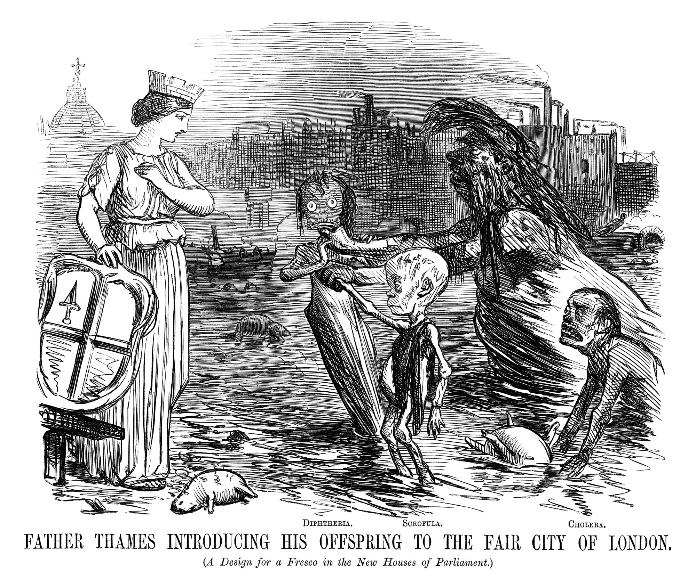

layout: true

<div class="my-footer"></div> 

---

```{r setup, include=FALSE,warning=FALSE,message=FALSE}
options(htmltools.dir.version = FALSE)
knitr::opts_chunk$set(
  message = FALSE,
  warning = FALSE,
  dev = "svg",
  cache = TRUE,
  fig.align = "center"
  #fig.width = 11,
  #fig.height = 5
)

# define vars
om = par("mar")
lowtop = c(om[1],om[2],0.1,om[4])
library(magrittr)
library(ggplot2)

```

# Where Are We At?

.pull-left[

## What Did we Do Last Week?

* We introduced the DiD method.

* We looked at the case minimum wages in NJ/Pennsylvania.

* We highlighted some drawbacks of the method and learned the underlying assumptions.

]


--

.pull-right[

## Today

* we will introduce *instrumental variables* (IV)

* To motivate IV, we will look back to London in 1850 and learn about John Snow.

* We will finally introduce the IV estimator formally.
]


---

# Setting the Scene

.pull-left[

* In chapters [7](https://scpoecon.github.io/ScPoEconometrics/causality.html), [8](https://scpoecon.github.io/ScPoEconometrics/STAR.html) and [9](https://scpoecon.github.io/ScPoEconometrics/RDD.html) of the book (and the intro course) we talk about the merits of _experimental methods_.

* Randomized Control Trials (RCTs) or _Quasiexperimental_ (as good as random) settings allow us to estimate **causal** effects. 

* In particular the [RCT](https://scpoecon.github.io/ScPoEconometrics/causality.html#rct) should be familiar to you.

]

--

.pull-right[

* If people have some sort of control about getting treatment, there will be *selection*.

* RCTs can break the self-selection of people into treatment by assigning randomly.

* So with experimental data, we have a good solution.

* What about non-experimental data?
]

---

# Non-Experimental Data

.pull-left[

* We talked about **omitted variable bias**.

* What if there is correlation between a variable in the error term $u$, $x_2$ say, and our explanatory variable $x_1$?

* We will obtain biased estimates because we cannot separate out what  is what: effect of $x_1$, or of $x_2$?

* Remember that this can be so severe that we don't even get the correct sign of an effect.
]

.pull-right[

```{r dag1,fig.height = 6,echo = FALSE}
library(ggdag)
library(dplyr)
dag = dagify(y ~ x1,
            y ~ x2,
            y ~ x3,
            x1 ~ x2,
            x3 ~ x2,
       coords = list(x = c("x2" = 0,"x1" = 1,"x3" = 1.0,"y" = 2),
                     y = c("x2" = 0,"x1" = 0.5,"x3" = -0.5,"y" = 0)))
p2 = dag %>%
  tidy_dagitty() %>%
      mutate(linetype = if_else(name =="x2", "dashed","solid")) %>% 
    ggplot(aes(x = x, y = y, xend = xend, yend = yend)) + 
    geom_dag_point() + 
      geom_dag_text(col = "white") +
    geom_dag_edges(aes(edge_linetype = linetype), show.legend = FALSE) + theme_dag()
p2
```
]

--

.center[**IV** provides a solution to OVB.]

---
background-image: url(../../img/Kensington_slums_large.jpg)
background-size: cover
class: middle

# Welcome to London in 1850

## .white[(Slum in Kensington)]

---

# John Snow's (Non) Experiment: Cholera Hits the Town

.pull-left[

* John Snow was a physician in London around 1850, when Cholera erupted several times in the City.

* There was a dispute at the time about how the disease is transmitted: via air or via water?

]

.pull-right[
```{r, fig.width=6,echo = FALSE}

```
]

---
background-image: url(../../img/slum.jpg)
background-size: cover

---
background-image: url(../../img/slum.jpg)
background-size: cover

.center[
<br>
<br>
<br>
.white[
## In 1850:


* Unknown that germs can cause disease.

* Microscopes exist, but work at rather poor resolution.

* Most human pathogens are not visible to the naked eye.

* The so-called *infection theory* (i.e. infection via *germs*) has some supporters,

* but the dominant idea is that disease, in general, results from [*miasmas*](https://en.wikipedia.org/wiki/Miasma_theory)
]

]

---
background-image: url(https://media.giphy.com/media/3s4jGZP9UapxROVVN9/giphy.gif)
background-size: 800px

# Let's Go Watch a Movie

<br>
<br>
<br>
<br>
<br>
<br>
<br>
<br>
<br>
<br>
<br>
<br>
<br>
<br>

--

.center[May the force be with you. (click [here!](https://youtu.be/lNjrAXGRda4?si=Oj-MONvr9Exp-2xo))]


---

# Snow's Detective Work

.pull-left[

* Snow collected a lot of data.

* He first mapped the location of dead during the 1854 outbreak.

* This was the notorious *Broadstreet Pump Outbreak*

]

--

.pull-right[
```{r snow-map,echo = FALSE}
knitr::include_graphics("../../img/snow-map.jpg")
```
]

---

# The `cholera` package

.pull-left[
* The `cholera` package has some interesting features.

* For example an R version of Snow's map:
]

.pull-right[
```{r}
cholera::snowMap()
```
]

---

# `cholera`

.pull-left[
...or the walking path of case number 15 in Snow's data:

```{r,echo = FALSE,fig.height = 5}
plot(cholera::walkingPath(15))
```
]

--

.pull-right[
...or estimate Voronoi Polygons for pump neighborhoods:
```{r,echo = FALSE,fig.height = 5}
# compute vertices of Voronoi tiles
vertices <- cholera::voronoiPolygons(sites = cholera::pumps, rw.data = cholera::roads)

# define colors
snow.colors <- grDevices::adjustcolor(cholera::snowColors(), alpha.f = 1/3)

# plot map and color coded tiles
cholera::snowMap(add.cases = FALSE)
invisible(lapply(seq_along(vertices), function(i) {
  polygon(vertices[[i]], col = snow.colors[[i]])
}))
```
]

---

# Removal of the Broad Street Pump?

.pull-left[
* Snow identified the Broad Street Pump as culprit.

* He pleaded to have its handle removed.

* He was sceptical this was the reason the epidemic ended.

]

.pull-right[
```{r,echo = FALSE}
plot(cholera::timeSeries())
```
]

---

# Mapping London's Water Supply


* Water supply came from the River Thames

* Different supply companies had different intake points

* Southwark and Vauxhall water companies took in water beneath a major sewage discharge.

* Lambeth water did not.


---

# Snow's conclusion

* Snow collected the following data: 

```{r,echo = FALSE}
st9 <- data.frame(area = c("Southwark and Vauxhall","Lambeth","Rest of London"),numhouses = c(40046,26107,256423), 
                  deaths = c(1263,98,1422),
                   death1000 = c(315,37,59))
knitr::kable(st9)
```

* And concluded

>that if Southwark and Vauxhall water companies had moved their water intakes upstream to where Lambeth water was taking in their supply, roughly 1,000 lives could have been saved. 

* For proponents of the miasma theory, this was still not evidence enough, because there were also many factors that led to poor air quality in those areas.

---

layout: false
class: separator, middle

# We Need A Model.

## Because: *It takes a model to beat a model*. attributed to Thomas L Sargent.


---
layout: true

<div class="my-footer"></div> 

---

# Snow's Model of Cholera Transmission


* Suppose that $c_i$ takes the value 1 if individual $i$ dies of cholera, 0 else.

* Let $w_i = 1$ mean that $i$'s water supply is impure and $w_i = 0$ vice versa. Water purity is assessed with a technology that cannot detect small microbes.

* Collect in $u_i$ all unobservable factors that impact $i$'s likelihood of dying from the disease: whether $i$ is poor, where exactly they reside, whether there is bad air quality in $i$'s surrounding, and other invidivual characteristics which impact the outcome (like genetic setup of $i$).

--

We can write:

$$
c_i = \alpha + \delta w_i + u_i 
$$

---

# Doing the Simple Thing is always right?

.pull-left[

* John Snow could have used his data and assess the correlation between drinking pure water and cholera incidence.

* measure $Cor(c_i,w_i)$

* Suppose $Cor(c_i,w_i) \approx 0.5$. Does that prove the infection theory?
]

--

.pull-right[
Note quite. Angus Deaton says:

> The people who drank impure water were also more likely to be poor, and to live in an environment contaminated in many ways, not least by the ‘poison miasmas’ that were then thought to be the cause of cholera.

☹️

]

---

# The Simple Thing


* It does not make sense to compare someone who drinks pure water with someone with impure water.

* because *all else is not equal*: pure water is correlated with being poor, living in bad area, bad air quality and so on - all factors that we encounter in $u_i$. 

* This violates the crucial orthogonality assumption for valid OLS estimates, $E[u_i | w_i]=0$ in this context. 

* Another way to say this, is that $Cov(w_i, u_i) \neq 0$, implying that $w_i$ is *endogenous*. 

* There are factors in $u_i$ that affect both $w_i$ and $c_i$

---

# Snow's Model and Some Algebra

Remember our simple model:
$$c_i = \alpha + \delta w_i + u_i$$
Now let's condition on both values of $w$:
\begin{align}
E[c_i | w_i = 1] &= \alpha + \delta + E[u_i | w_i = 1] \\
E[c_i | w_i = 0] &= \alpha + \phantom{\delta} + E[u_i | w_i = 0]
\end{align}

--

Now substract one line from the other:

\begin{equation}
E[c_i | w_i = 1] - E[c_i | w_i = 0] = \delta + \left\{ E[u_i | w_i = 1] - E[u_i | w_i = 0]\right\}
\end{equation}

* The last term $\left\{ E[u_i | w_i = 1] - E[u_i | w_i = 0]\right\}$ is not equal to zero (by what Deaton said!)

* A regression estimate for $\delta$ would be biased by that quantity.

---


layout: false
class: separator, middle

# The IV Estimator


---
layout: true

<div class="my-footer"></div> 

---

# John Snow Says

> [...] the mixing of the supply is of the most intimate kind. The pipes of each Company go down all the streets, and into nearly all the courts and alleys. [...] The experiment, too, is on the grandest scale. No fewer than three hundred thousand people of both sexes, of every age and occupation, and of every rank and station, from gentlefolks down to the very poor, were divided into two groups without their choice, and in most cases, without their knowledge; one group supplied with water containing the sewage of London, and amongst it, whatever might have come from the cholera patients, the other group having water quite free from such impurity.

---
background-image: url("../../img/snow-supply.jpg")
background-size: cover

# London Water Supply

---

# Proposing an IV

* Snow is proposing an **instrumental variable** $z_i$, the *identity of the water supplying company* to household $i$:

More formally, let's define the instrument as follows:

\begin{align*}
z_i &=  \begin{cases}
                    1 & \text{if water supplied by Lambeth} \\
                    0 & \text{if water supplied by Southwark or Vauxhall.} \\
                 \end{cases} \\
\end{align*}

* $z_i$ is highly correlated with the water purity $w_i$. 

* However, it seems to be uncorrelated with all the other factors in $u_i$, which worried us before: Water supply was decided years before, and now houses on the same street have different suppliers!

---
background-image: url(../../img/IV-dag.png)
background-position: 60% 50%

# Simple IV in a DAG

* $u$ affects both outcome and explanatory variable

```{r IV-dag,warning = FALSE,eval = FALSE,message = FALSE,echo = FALSE,fig.height = 5}
library(ggdag)
library(dplyr)
coords <- list(
    x = c(z = 1, w = 3, u = 4, c = 5),
    y = c(z = 0, w = 0, u = 0.5, c = 0)
    )

dag <- dagify(c ~ w + u,
              w ~ z + u, coords = coords)

dag %>% 
  tidy_dagitty() %>% 
  mutate(linetype = ifelse(name == "u", "dashed", "solid")) %>% 
  ggplot(aes(x = x, y = y, xend = xend, yend = yend)) + 
  geom_dag_point() + 
  geom_dag_text() + 
  geom_dag_edges(aes(edge_linetype = linetype), show.legend = FALSE) + 
  theme_void()

```

---

# Defining Snow's IV Formally


--

Here are the conditions for a valid instrument:

1. **Relevance** or **First Stage**: Water purity is indeed a function of supplier identity. We want that $$E[w_i | z_i = 1] \neq E[w_i | z_i = 0]$$ i.e. the average water purity differs across suppliers. We can *verify* this condition with observational data. We want this effect to be reliably causal.

--

2. **Independence**: Whether a household has $z_i = 1$ or $z_i = 0$ is unrelated to $u$, hence *as good as random*. Whether we condition $u$ on certain values of $z$ does not change the result - we want $$E[u_i | z_i = 1] = E[u_i | z_i = 0].$$

--

3. **Excludability** the instrument should affect the outcome $c$ *only* through the specified channel (i.e. via water purity $w$), and nothing else.


---

# Defining the IV Estimator

We are now ready to define a simple IV estimator. Like before, let's condition on the values of $z$:

\begin{align}
E[c_i | z_i = 1] &= \alpha + \delta E[w_i | z_i = 1] + E[u_i | z_i = 1] \\
E[c_i | z_i = 0] &= \alpha + \delta E[w_i | z_i = 0] + E[u_i | z_i = 0]
\end{align}

which upon differencing both lines gives 

\begin{align}
E[c_i | z_i = 1] - E[c_i | z_i = 0] &= \delta  \left\{ E[w_i | z_i = 1] - E[w_i | z_i = 0]\right\} \\
&+ \underbrace{\left\{ E[u_i | z_i = 1] - E[u_i | z_i = 0] \right\}}_{=0 \text{ by Exogeneity Assumption}}
\end{align}

--

* Finally, if the IV is *relevant*, i.e. $E[w_i | z_i = 1] - E[w_i | z_i = 0] \neq 0$:

\begin{equation}
\delta = \frac{E[c_i | z_i = 1] - E[c_i | z_i = 0]}{E[w_i | z_i = 1] - E[w_i | z_i = 0]} (\#eq:IV)
\end{equation}


---

# Special Case: Wald Estimator

Let's say that $x \mapsto y$ means that $x$ is an estimate for $y$:

1. $\overline{c}_1 \mapsto E[c_i | z_i = 1]$: the proportion of households supplied by Lambeth with cholera.
1. $\overline{w}_1 \mapsto E[w_i | z_i = 1]$: the proportion of households supplied by Lambeth with bad water.
1. $\overline{c}_0 \mapsto E[c_i | z_i = 0]$: the proportion of households not supplied by Lambeth with cholera.
1. $\overline{w}_0 \mapsto E[w_i | z_i = 0]$: the proportion of households not supplied by Lambeth with bad water.

The estimator would then be

\begin{equation}
\hat{\delta} = \frac{\overline{c}_1 - \overline{c}_0}{\overline{w}_1 - \overline{w}_0} 
\end{equation}

In this special case where all involved variables $c,w,z$ are binary, the estimator is called the *Wald estimator*.

---

**Summary**: IVs are a powerful tool to establish causality in contexts with observational data only and where we are concerned that the conditional mean assumption $E[u_i | x_i]=0$ is violated, hence, we cannot say *all else equal, as $x$ changes, $y$ changes like this and that*. Then we say that $x$ is *endogenous*. The key features of IV $z$ are that 

1. $z$ is *relevant* for $x$. For example, in a simple regression of $z$ on $x$, we want $z$ to have considerable predictive power. We can *test* this condition in data.
2. We need a theory according to which is *reasonable* to assume that $z$ is *unrelated* to other unobservable factors that might impact the outcome. Hence, $z$ is *exogenous* to $u$, or $E[u | z] = 0$. This is an **assumption** (i.e. we can not test this with data).


---


class: title-slide-final, middle
background-image: url(../img/logo/ScPo-econ.png)
background-size: 250px
background-position: 9% 19%

# END


|                                                                                                            |                                   |
| :--------------------------------------------------------------------------------------------------------- | :-------------------------------- |
| <a href="mailto:florian.oswald@sciencespo.fr">.ScPored[<i class="fa fa-paper-plane fa-fw"></i>]               | florian.oswald@sciencespo.fr       |
| <a href="https://github.com/ScPoEcon/Advanced-Metrics-slides">.ScPored[<i class="fa fa-link fa-fw"></i>] | Slides |
| <a href="https://scpoecon.github.io/ScPoEconometrics">.ScPored[<i class="fa fa-link fa-fw"></i>] | Book |
| <a href="http://twitter.com/ScPoEcon">.ScPored[<i class="fa fa-twitter fa-fw"></i>]                          | @ScPoEcon                         |
| <a href="http://github.com/ScPoEcon">.ScPored[<i class="fa fa-github fa-fw"></i>]                          | @ScPoEcon                       |

