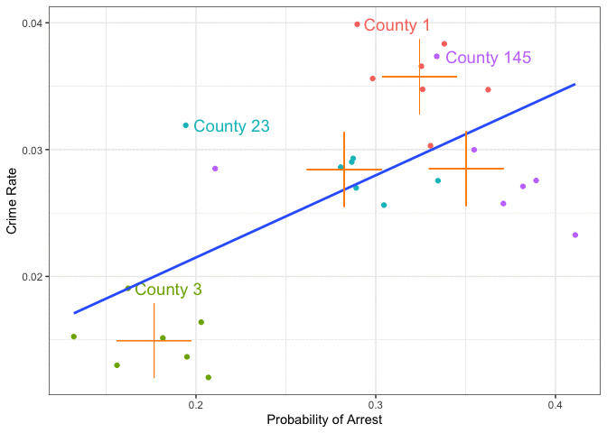

layout: true

<div class="my-footer"></div> 

---

```{r setup, include=FALSE,warning=FALSE,message=FALSE}
options(htmltools.dir.version = FALSE)
knitr::opts_chunk$set(
  message = FALSE,
  warning = FALSE,
  dev = "svg",
  cache = TRUE,
  fig.align = "center"
  #fig.width = 11,
  #fig.height = 5
)

# define vars
om = par("mar")
lowtop = c(om[1],om[2],0.1,om[4])
library(magrittr)

library(data.table)
gofmap = data.table(modelsummary::gof_map)
gofmap[,omit := TRUE]
gofmap[clean == "R2", omit := FALSE]

```

# Where Did We Stop Last Time?

.pull-left[
* **IV** estimation

* Some important applications

* Some pitfalls

]

--

.pull-right[
**Today**

1. Talk about Mid-Term Exam! 😬

2. Revisit the Ability Bias [in an App](https://floswald.shinyapps.io/ScPoMetrics-ability-bias/) 😎

3. Introduce Panel Data

]


---

# Cross-Sectional Data

.pull-left[
So far, we dealt with data that looks like this:

```{r,message=FALSE,warning=FALSE,echo = FALSE}
library(dplyr)
library(ggplot2)
data(crime4,package = "wooldridge")
crime4 %>%
  filter(year == 81) %>%
  arrange(county,year) %>%
  select(county, crmrte, prbarr) %>%
  rename(County = county,
         CrimeRate = crmrte,
         ProbofArrest = prbarr) %>%
  slice(1:5) %>%
  knitr::kable(align = "ccc")
```
]

.pull-right[

* We have a unit identifier (like `County` here), 

* Observables on each unit.

* Usually called a **cross-sectional** dataset

* Provides single snapshot view

* Each row, in other words, is one *observation*.
]


---

# Panel Data

.pull-left[
Now, let's add a `time` index: `Year`.

```{r,echo = FALSE}
crime4 %>%
  select(county, year, crmrte, prbarr) %>%
  arrange(county,year) %>%
  rename(County = county,
         Year = year,
         CrimeRate = crmrte,
         ProbofArrest = prbarr) %>%
  slice(1:9) %>%
  knitr::kable(align = "ccc")
```
]

.pull-right[

* Next to the unit identifier (`County`) we now have `Year` 

* Now a pair (`County`,`Year`) indexes one observation.

* We call this a **panel** or **longitudinal** dataset

* We can track units *over time*.

]


---

# Crime Rates and Probability of Arrest

* The above data can be loaded with
    ```{r, eval = FALSE}
    data(crime4,package = "wooldridge")
    ```

* They are from [C. Cornwell and W. Trumball (1994), “Estimating the Economic Model of Crime with Panel Data”](https://www.amherst.edu/media/view/121570/original/CornwellTrumbullCrime%2BElasticities.pdf). 

--

* One question here: *how big is the deterrent effect of law enforcement*? If you know you are more likely to get arrested, will you be less likely to commit a crime?

--

* This is tricky: Does high crime *cause* stronger police response, which acts as a deterrent, or is crime low because deterrent is strong to start with?

* This is sometimes called a *simultaneous equation model* situation: police response impacts crime, but crime impacts police response

\begin{align}
police &= \alpha_0 + \alpha_1 crime \\
crime &= \beta_0 + \beta_1 police
\end{align}


---

# Crime Rates and Probability of Arrest

.pull-left[

* Most literature prior to that paper estimated simultaneous equations off cross sectional data

* Cornwell and Trumball are worried about **unobserved heterogeneity** between jurisdictions.

* Why? What could possibly go wrong?

]

.pull-right[

* Let's pick out 4 counties from their dataset

* Let's look at the crime rate vs probability of arrest relationship

* First for all of them together as a single cross section

* Then taking advantage of the panel structure (i.e. each county over time).

]


---

# Crime vs Arrest in Cross Section

.left-thin[

1. Subset data to 4 counties

2. plot probability of arrest vs crime rate.

```{r crime1,echo = TRUE, eval = FALSE}
css = crime4 %>% 
  filter(county %in% 
           c(1,3,145, 23))  

ggplot(css,
       aes(x = prbarr, 
           y = crmrte)) + 
  geom_point() + 
  geom_smooth(method="lm",
              se=FALSE) + 
  theme_bw() +
  labs(x = 'Probability of Arrest', 
       y = 'Crime Rate')
```
]

.right-wide[
```{r,echo = FALSE,fig.height=5}
css = crime4 %>% 
  filter(county %in% c(1,3,145, 23))  # subset to 4 counties

ggplot(css,aes(x =  prbarr, y = crmrte)) + 
  geom_point() + 
  geom_smooth(method="lm",se=FALSE) + 
  theme_bw() +
  labs(x = 'Probability of Arrest', y = 'Crime Rate')
```
]

---

# Crime vs Arrest in Cross Section: Positive Relationship!

.pull-left[

* We see an upward sloping line!

* Higher probability of arrest is associated to higher crime rates.

* How strong is the effect?
]

--

.pull-right[
```{r}
xsection = lm(crmrte ~ prbarr, css)
coef(xsection)[2]  # gets slope coef
```

```{r,echo = FALSE}
xsection_p = round(predict(xsection,newdata = data.frame(prbarr = c(0.2,0.3))),3)
```

* Increasing probability of arrest by 1 unit (i.e. 100 percentage point), increases the crime rate by `r coef(xsection)[2]`. So, it becomes twice as likely that you get caught, an overall crime would increase by 0.064 crimes per person.

* Increase of 10 percentage points in the probability of arrest (e.g. `prbarr` goes from 0.2 to 0.3) ...

* ... is associated with an increase in crime rate from `r xsection_p[1]` to `r xsection_p[2]`, or a `r round(100 * diff(xsection_p) / xsection_p[1],2)` percent increase in the crime rate.

]

---

# Ok, but what does that *mean*?


* Literally: counties with a higher probability of being arrested also have a higher crime rate. 

* So, does it mean that as there is more crime in certain areas, the police become more efficient at arresting criminals, and so the probability of getting arrested on any committed crime goes up?

* What does police efficiency depend on? 

* Does the poverty level in a county matter for this? 

* The local laws?

* 🤯 wow, there seem to be too many things left out of this simple picture. 


---

# Crime in a DAG

```{r cri-dag,echo = FALSE,message = FALSE,fig.height=5.5}
library(ggdag)
coords <- list(
    x = c(ProbArrest = 1,LawAndOrder = 1, Police = 1.5, CivilRights = 3,Poverty = 3, CrimeRate = 5, LocalStuff = 5),
    y = c(ProbArrest = 1,LawAndOrder = 4, Police = 2.5, CivilRights = 2,Poverty = 4, CrimeRate = 1, LocalStuff = 4)
    )
dagify(CrimeRate ~ ProbArrest,
       CrimeRate ~ LocalStuff,
       CrimeRate ~ Poverty,
       CrimeRate ~ CivilRights,
       ProbArrest ~ LocalStuff,
       Poverty ~ LocalStuff,
       ProbArrest ~ Poverty,
       ProbArrest ~ LawAndOrder,
       ProbArrest ~ Police,
       ProbArrest ~ LawAndOrder,
       CivilRights ~ LawAndOrder,
       Police ~ LawAndOrder,
       labels = c("CrimeRate" = "Crime Rate",
                  "ProbArrest" = "ProbArrest",
                  "LocalStuff" = "LocalStuff",
                  "Poverty" = "Poverty",
                  "Police" = "Police",
                  "CivilRights" = "CivilRights",
                  "LawAndOrder" = "LawAndOrder"
                  ),
       exposure = "ProbArrest",
       outcome = "CrimeRate",
       coords = coords) %>%
  ggdag(text = FALSE, use_labels = "label") + ggtitle("What causes the Crime Rate in County i?") + theme_dag()
```

```{css, echo = F}
.reduced_opacity {
  opacity: 0.2;
}
```

---
background-image: url(../../img/crime-dag.png)
background-size: 400px
background-position: 93% 10%


# Crime in a DAG

.left-wide[
**Fixed Characteristics**: vary by county

* `LocalStuff` are things that describe the County, like geography, and other persistent features.
* `LawAndOrder`: commitment to *law and order politics* of local politicians
* `CivilRights`: how many civil rights you have

and how many `CivilRights` one gets might change a little from year to year, but not very drastically. Let's assume they are fixed characteristics as well.

**Time-varying Characteristics**: vary by county and by year

* `Police` budget: an elected politician has some discretion over police spending

* `Poverty` level varies with the national/global state of the economy.

] 

.right-thin[


]


---

# Within and Between Variation

You will often hear the terms *within* and *between* variation in panel data contexts.

.pull-left[

## Within Variation

* things that change *within each group* over time: 

* here we said police budgets

* and poverty levels would change within each group and over time. 

]

.pull-right[

## Between Variation

* Things that are **fixed** for each group over time:

* `LocalStuff`

* `LawAndOrder` and 

* `CivilRights` 

* differ only across or **between** groups


]

---
background-image: url("https://media.giphy.com/media/3oKIPlLZEbEbacWqOc/giphy.gif")
background-position: 90% 50%
background-size: 300px

# Within and Between Variation

.left-wide[
```{r,echo = FALSE,message = FALSE,fig.height = 5}
pcolor = css %>% 
  group_by(county) %>%
  mutate(label = case_when(
    crmrte == max(crmrte) ~ paste('County',county),
    TRUE ~ NA_character_
  ),
  mcrm = mean(crmrte),
  mpr = mean(prbarr)) %>%
  ggplot(aes(x =  prbarr, y = crmrte, label = label)) + 
  geom_point(aes(color = factor(county))) + 
  theme_bw() +
  geom_smooth(method = "lm", se=FALSE) +
  labs(x = 'Probability of Arrest', 
       y = 'Crime Rate',
       color = "County") 
pcolor
```
]


---

# Pooled OLS recovers *between* variation


* Let's add the mean of `prbarr` and `crmrte` for each of those counties to the scatter plot!

* And then a regression through those 4 points!


--


```{r,echo = FALSE,fig.height = 4,warning = FALSE,message = FALSE}
p1 = css %>% 
  group_by(county) %>%
  mutate(label = case_when(
    crmrte == max(crmrte) ~ paste('County',county),
    TRUE ~ NA_character_
  ),
  mcrm = mean(crmrte),
  mpr = mean(prbarr)) %>%
  ggplot(aes(x =  prbarr, y = crmrte, label = label)) + 
  geom_point(aes(color = factor(county))) + 
  theme_bw() +
  # geom_smooth(method = "lm", se=FALSE) +
  scale_x_continuous(limits = c(0.1,0.43)) + 
  scale_y_continuous(limits = c(0.01,0.041)) +
  labs(x = 'Probability of Arrest', 
       y = 'Crime Rate',
       color = "County")  + 
  # scale_color_manual(values = c('black','blue','red','purple'))
  geom_point(aes(x = mpr, y = mcrm,color = factor(county)), size = 20, shape = 3) + 
  annotate(geom = 'text', x = .3, y = .02, label = 'Means Within Each County', color = 'darkorange', size = 14/.pt) + 
  guides(color = FALSE, labels = FALSE)


p2 = css %>% 
  group_by(county) %>%
  mutate(label = case_when(
    crmrte == max(crmrte) ~ paste('County',county),
    TRUE ~ NA_character_
  ),
  mcrm = mean(crmrte),
  mpr = mean(prbarr)) %>%
  ggplot(aes(x = mpr, y = mcrm)) + 
  theme_bw() +
  geom_smooth(method = "lm",se = FALSE) +
  geom_point(size = 20, shape = 3, aes(color = factor(county))) +   
  scale_x_continuous(limits = c(0.1,0.43)) + 
  scale_y_continuous(limits = c(0.01,0.041)) +
  labs(x = 'Probability of Arrest', 
       y = 'Crime Rate') + 
  guides(color = FALSE, labels = FALSE)
cowplot::plot_grid(p1,p2,align = "v")

```

---

# Accounting for Grouped Data

.left-wide[
```{r cri-dag2,echo = FALSE,message = FALSE,fig.height = 5}
coords <- list(
    x = c(ProbArrest = 1,Poverty = 1, Police = 1.5, County = 3, CrimeRate = 4),
    y = c(ProbArrest = 1,Police = 2.5, Poverty = 4, CrimeRate = 1, County = 4)
    )
gdag1 <- dagify(CrimeRate ~ ProbArrest,
       CrimeRate ~ County,
       CrimeRate ~ Poverty,
       ProbArrest ~ Poverty,
       ProbArrest ~ County,
       Poverty ~ County,
       ProbArrest ~ Police,
       Police ~ County,
       labels = c("CrimeRate" = "Crime Rate",
                  "ProbArrest" = "ProbArrest",
                  "County" = "County",
                  "Poverty" = "Poverty",
                  "Police" = "Police"),
       exposure = "ProbArrest",
       outcome = "CrimeRate",
       coords = coords) %>%
  ggdag(text = FALSE, use_labels = "label")  + theme_dag()
gdag1
```
]

.right-thin[

* Collect all group-specific time-invariant features in the factor `County`.

* Takes care of all factors which do *not* vary over time within each unit. 

* We can **net out** the group effect!

* We call `County` a **fixed effect**.

]


---
class: separator, middle

# Fixed Effects Estimation in `R`


---

# OVB, IV and Panel Data

We've seen *unobserved variable bias* (OVB). For example, if the true model read:

$$
y_i = \beta_0 + \beta_1 x_i + c_i + u_i
$$
if $c_i$ unobservable and $Cov(x_i,c_i)\neq0 \Rightarrow E[u_i+c_i|x_i]\neq 0,\text{ with }u_i + c_i$ total unobserved component). 

--

.pull-left[

## Cross-Sectional Solution

* where $c=A_i$ and $x=s$ was schooling.

* *ability bias*. 

* Find IV correlated with schooling but not ability
]

--

.pull-right[

## Panel Data

$$y_{it} = \beta_1 x_{it} + c_i + u_{it},\quad t=1,2,...T$$
* $c_i$: *individual fixed effect*, *unobserved effect* or *unobserved heterogeneity*. 

* $c_i$: is fixed over time (ability $A_i$ for example), but can be correlated with $x_{it}$!
]


---

# Dummy Variable Regression


.pull-left[
<br>
<br>

* Simplest approach: include a dummy variable for each $i$. 

* This is literally *controlling for county* i

* Each $i$ has basically their own intercept $c_i$

* In `R` you achieve this like so:

]

.pull-right[
<br>
<br>
$$y_{it} = \beta_1 x_{it} + c_i + u_{it},\quad t=1,2,...T$$

```{r}
mod = list()
mod$dummy <- lm(crmrte ~ prbarr + factor(county), css)  # i is the unit ID
broom::tidy(mod$dummy)
```

]

---

# Dummy Variable Regression

.left-wide[
```{r dummy,echo = FALSE,message = FALSE,fig.height = 5}
# not sure that's helpful
css$pred <- predict(mod$dummy)  # get predicted line
pcolor = css %>% 
  group_by(county) %>%
  ggplot(aes(x =  prbarr, y = crmrte, color =factor(county) )) +
  geom_point() + 
  geom_line(aes(y = pred )) +
  theme_bw() +
  # geom_smooth(method = "lm", se=FALSE) +
  labs(x = 'Probability of Arrest', 
       y = 'Crime Rate',
       color = "County") 
pcolor
```
]

.right-thin[
* *Within* each county, now is a **negative** relationship!! 

* Different intercepts (county 1 is be the reference group), 

* Unique slope coefficient $\beta$. (you observe that the lines are parallel).

* We are shifting lines down from the reference group 1.
]

---

# First Differencing Solution

If we only had $T=2$ periods, we could just difference both periods, basically leaving us with
    
$$\begin{align}y_{i1} &= \beta_1 x_{i1} + c_i + u_{i1} \\y_{i2} &= \beta_1 x_{i2} + c_i + u_{i2} \\& \Rightarrow \\
y_{i1}-y_{i2} &= \beta_1 (x_{i1} - x_{i2}) + c_i-c_i + u_{i1}-u_{i2} \\\Delta y_{i} &= \beta_1 \Delta x_{i} + \Delta u_{i}\end{align}$$

where $\Delta$ means *difference over time of* and to recover the parameter of interest $\beta_1$ we would run

```{r,eval=FALSE}
lm(deltay ~ deltax, diff_data) 
```
    
    
    
---


# The Within Transformation

.pull-left[
* With $T>2$ we need a different approach

* One important concept is called the *within* transformation

* So, *controlling for group identity and only looking at time variation* 

* Remember DAG!

]

.pull-right[

* Let $\bar{x}_i$ the average *over time* of $i$'s $x$ values:

$$\bar{x}_i = \frac{1}{T} \sum_{t=1}^T x_{it}$$

1. for all variables compute their time-mean for each unit $i$: $\bar{x}_i,\bar{y}_i$ etc
1. for each observation, substract that time mean from the actual value and define $(x_{it} - \bar{x}_i),(y_{it}-\bar{y}_i)$
1. Finally, regress $(x_{it} - \bar{x}_i)$ on $(y_{it}-\bar{y}_i)$

]

---

# The Within Transformation in `R`: Manual Solution

This *works* for our problem with fixed effect $c_i$ because $c_i$ is not time varying by assumption! hence it drops out: 

$$y_{it}-\bar{y}_i = \beta_1 (x_{it} - \bar{x}_i) + c_i - c_i + u_{it}-\bar{u}_i$$


It's easy to do yourself! First let's compute the demeaned values:

```{r}
cdata <- css %>%
  group_by(county) %>%
  mutate(mean_crime = mean(crmrte),
         mean_prob = mean(prbarr)) %>%
  mutate(demeaned_crime = crmrte - mean_crime,
         demeaned_prob = prbarr - mean_prob)
```

Then, run both models with simple OLS:

```{r}
mod$xsect <- lm(crmrte ~ prbarr, data = cdata)
mod$demeaned <- lm(demeaned_crime ~ demeaned_prob, data = cdata)
```

---

# The Within Transformation in `R`: Manual Solution


.left-wide[
We get this table:

```{r tab1,echo = FALSE}
library(huxtable)
ht = modelsummary::modelsummary(mod[c("xsect","dummy","demeaned")],
                           statistic = 'std.error',
                           coef_omit = "factor",
                           gof_map = gofmap,output = "huxtable")
ht %>%
  set_text_color(row = c(4,6), col = c(3,4), value = 'red')
```
]

.left-thin[

* Estimate for `prbarr` is positive in the cross-section

* Taking care of the unobservered heterogeneity $c_i$...

* ...either by including an intercept for each $i$ or by time-demeaning the data

* we obtain: `r round(coef(mod$demeaned)[2],3)` .

]

---

# Interpreting the Within Estimates


```{r,echo = FALSE}
panel_p = round(predict(mod$dummy,newdata = data.frame(prbarr = c(0.2,0.3), county = factor(1))),3)
```

* How to interpret those negative slopes?

* We look at a single unit $i$ and ask: 

> if the arrest probability in $i$ increases by 10 percentage points (i.e. from 0.2 to 0.3) from year $t$ to $t+1$, we expect crimes per person to fall from `r panel_p[1]` to `r panel_p[2]`, or by `r round(100 * diff(panel_p) / panel_p[1],2)` percent (in the reference county number 1).

```{r,echo = FALSE,fig.height = 3}
pcolor
```


---

# Fixed Effects Estimation in `R`: use a Package!


* In real life you will hardly ever perform the within-transformation by yourself 

* and use a package instead!

* There are several options ([`fixest` is fastest](https://github.com/lrberge/fixest)). In our context:

```{r}
mod$FE = fixest::feols(crmrte ~ prbarr | county, cdata)
```

* Notice the similar setup to the `estimatr::iv_robust` *two-part formula*. Here the fixed effects come after the `|`. 

* Also, we can have *more than one fixed effect*! For a cool example with *three* fixed effects see the package [vignette](https://cran.r-project.org/web/packages/fixest/vignettes/fixest_walkthrough.html)

---

# Fixed Effects Estimation in `R`: use `fixest` 🙂

.left-wide[
```{r,echo = FALSE}
ht = modelsummary::modelsummary(mod[c("xsect","dummy","demeaned","FE")],
                           statistic = 'std.error',
                           coef_omit = "factor",
                           gof_map = gofmap,output = "huxtable")

ht %>%
    set_text_color(row = c(4,6,4), col = c(3,4,5), value = 'red')
  
```
]

.right-thin[
<br>

* Same estimates! 😅

* Notice the standard errors: *robust*?!

* `fixest` computes **cluster-robust** se's. 

* We suspect there is strong correlation in residuals *within* each county (over time).

]


---

# Within Transformation Animated

.left-wide[

```{r,echo = FALSE}

```
]

.right-thin[

* The within transformation **centers** the data!

* By time-demeaning $y$ and $x$, we *project out* the fixed factors related to *county*

* Only *within* county variation is left.

* Made by [Nick C Huntington-Klein](http://nickchk.com).  🙏

]
---

class: title-slide-final, middle
background-image: url(../../img/logo/ScPo-econ.png)
background-size: 250px
background-position: 9% 19%

# END


|                                                                                                            |                                   |
| :--------------------------------------------------------------------------------------------------------- | :-------------------------------- |
| <a href="mailto:florian.oswald@sciencespo.fr">.ScPored[<i class="fa fa-paper-plane fa-fw"></i>]               | florian.oswald@sciencespo.fr       |
| <a href="https://github.com/ScPoEcon/Advanced-Metrics-slides">.ScPored[<i class="fa fa-link fa-fw"></i>] | Slides |
| <a href="https://scpoecon.github.io/ScPoEconometrics">.ScPored[<i class="fa fa-link fa-fw"></i>] | Book |
| <a href="http://twitter.com/ScPoEcon">.ScPored[<i class="fa fa-twitter fa-fw"></i>]                          | @ScPoEcon                         |
| <a href="http://github.com/ScPoEcon">.ScPored[<i class="fa fa-github fa-fw"></i>]                          | @ScPoEcon                       |

